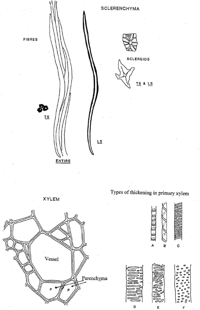

#Week 5: Plant Cells

You should refer to the notes on Light Microscopy and the use of the
Olympus CHA Microscope which you will find in the back of this manual.

Only a few types of cell are found in higher plants. These can be
recognised on several basic features:

- shape

- wall thickness

- wall composition

- whether empty or full of cytoplasm

- presence or absence of specific organelles such as chloroplasts.

Once you are familiar with the diagnostic features of various cell
types, you can recognise these in any unknown section and use the
information to work out complex tissue arrangements in leaves, stems or
roots.

The practical skills you should aim to perfect in this lab are:

1. recognition of the major cell types in supporting and ground tissue

2. section cutting by hand with a razor blade

3. drawing what you see

This practical deals *only* with the cell types found in supporting tissue. 
Cells modified for transport are dealt with later in the course.

##Parenchyma and Collenchyma

Celery is a leaf petiole. Strip off one of the celery "strings" - these
are strands of collenchyma tissue. Do not confuse collenchyma with the
vascular bundles. Note how elastic the strings are.

Cut several thin transverse sections of the petiole. Stain your thinnest
sections with toluidine blue. You should stain them until the whole
section becomes a deep purple with blue areas in the vascular bundles.
The collenchyma walls now stain purple. Are these walls lignified? What
colour do lignified walls stain?

**Make a high power drawing of three collenchyma cells showing the
position of wall thickenings and middle lamella. **

\vspace*{20\baselineskip}

Cut an L.S. and stain with toluidine blue and examine. Locate the ends
of the cells. Make a sketch to illustrate the shape in 3-D of a
collenchyma cell. How much longer are they than wide?

Compare the parenchyma cells in the ground tissue with the collenchyma
with respect to the following:

a. overall cell diameter

b. diameter of cell lumen

c. colour of wall staining with toluidine blue

d. cell length

e. wall thickness

f. appearance of intercellular space

Make a high power drawing of **3 parenchyma** cells for comparison with
the collenchyma to illustrate the differences.

\vspace*{20\baselineskip}

##Aerenchyma and Chlorenchyma

These are two common types of specialised parenchyma.

Cut sections of the *Juncus* cladode. Rinse for 10 minutes, then stain
with toluidine blue and examine

The pith of the cladode is filled with *aerenchyma* while the cortex is
*chlorenchyma*.

- What is the characteristic of chlorenchyma?

\vspace*{5\baselineskip}

- What are the diagnostic features of aerenchyma, with respect to wall
thickness and staining, cell contents and cell shape?

\vspace*{5\baselineskip}

Draw a few cells in an accurate, high power diagram and hand in for
assessment.

\vspace*{20\baselineskip}

Why should plants have aerenchyma?

\vspace*{6\baselineskip}

 ***FEEDBACK***: **You will likely be assessed on biological drawing
 from microscope sections in the practical exam. Hand in your drawing
 of the *Juncus* cladode and we will provide feedback. A submission of
 this drawing will count towards your participation mark.**

## Sclerenchyma

### Sclereids

 Taste the apple and pear and compare the texture of the two fruits.
 Cut thin sections through the pulp of each fruit. Rinse for 10 minutes,
 then stain with toluidine blue for 5 minutes, rinse again. Mount in
 glycerine and examine. You may have to squash the pear tissue. (When
 squashing a section on a slide, wrap the slide in a tissue and press
 gently but firmly with your thumb - taking care to avoid twisting - and
 not breaking the cover-slip.)

- Can you explain the difference in texture in cellular terms?

\vspace*{3\baselineskip}

Draw a small (no more than 5) group of sclereids accurately.

\vspace*{10\baselineskip}

Again determine wall thickness, chemical composition of the wall and
whether the contents are living or not. Locate the pits by careful
focusing using high power.

- Do both fruits have sclereids? What might be the possible functional
significance of such cells in a fruit?

\vspace*{3\baselineskip}

- Cut a section of the *Hakea* leaf provided. Where are the sclereids? What is their staining reaction with toluidine blue and what inference can you draw about wall composition? What do you need to do in order to confirm that these are indeed sclereids and not fibres?

\vspace*{6\baselineskip}

### Fibres

 Examine the leaves of *Lomandra longifolia* Notice how hard and
 stiff they are. Hard leaves contain large numbers of fibres and are
 often termed sclerophylls. Cut free hand sections across the leaf with a
 razor blade to determine the distribution of fibres. Stain with toluidine blue, rinse, mount in glycerine and examine.

The fibres occur in groups on either side of the vascular bundles to
form leaf ridges. The lignin in their walls stains bright blue with
toluidine blue. Determine wall thickness, composition, nature of
contents etc. and draw if you have time.

 Now cut sections at right angles to your previous ones, ie.
 paradermal, to obtain an LS through a fibre bundle and stain as above.
 What is the relationship between the length and width of these fibres?
 Which of those cell types you have studied today are the fibres most
 like and in what important ways do they differ from these?

\vspace*{6\baselineskip}

## Plant Identification 

We will examine the key traits and features of some of the **major
Australian plant families** throughout this course. Details for these
families are provided in the back of the lab manual (Plant
Identification and Family Descriptions, and the Key to Australian Plant
Families).

## Plant Cells: Supplementary Notes

Various different types of cells are found in the mature plant body.
Each performs a specific function. In the practical classes you will be
looking at a range of different plant tissues and you will be expected
to be able to identify the major cell types. The notes given below
should help to clarify the important features of each type.

### Parenchyma

In herbaceous plants 80% of the plant body is composed of parenchyma.
The term parenchyma is used for tissues composed of *living* cells
generally having *thin wholly primary walls* and a *polyhedral shape*
(generally but not always isodiametric) (See Fiures). [A wall is said
to be wholly primary if the thickening of the wall is completed before
the cell has reached its full size, any thickening laid down after the
cell has reached its full size is said to be secondary.] Parenchyma is
the main representative of the ground tissue system: this forms a
continuous tissue in all major plant organs, e.g., cortex of roots, pith
and cortex of stems, ground tissue of petioles and mesophyll of leaves.
Parenchyma cells also occur as components of complex tissue systems
(such as xylem and phloem) either scattered singly or aggregated.
Generally parenchyma is unlignified but lignified parenchyma can occur,
particularly as a component of xylem. A number of types of parenchyma
can be recognised including:

- **chlorenchyma**: parenchyma containing chloroplasts, found in leaves,
 outsides of stems and rarely in certain specialized roots;

-  **storage parenchyma**: contains stored food reserves, most commonly
 starch grains but other reserves also occur such as sucrose, inulin
 etc.; may be found throughout the plant or concentrated in special
 storage organs such as tubers, rhizomes, storage roots etc.;

- **aerenchyma**: parenchyma in which the cells have extended processes
 so increasing the amount of intercellular air space in the tissue.
 Found in some leaves, e.g., *Ananas* (pineapple), *Canna*, some stems,
 e.g., *Juncus*, and the roots of many plants from waterlogged
 habitats.

### Collenchyma

Collenchyma is a living tissue composed of more or less elongated cells
with thick, non-lignified primary walls (see Figures). It is the main
supporting tissue in the leaves and stems of many dicotyledons, for
example in the midrib and petiole of leaves and in strands in the outer
cortex of stems (often forming ridges). Collenchyma is well adapted to
function as support tissue in growing organs, as it combines high
tensile strength with considerable plasticity. Unlike sclerenchyma it is
extensible. The cell walls are made of cellulose, hemicellulose and
pectin and normally stain a very bright pink with toluidine blue and are
considered to be primary. *The wall material is deposited unevenly and
is particularly thick at cell corners* - a good diagnostic feature in
TS.

With age, the cells of collenchyma may, in some species become lignified
and therefore the tissue changes into sclerenchyma.

### Sclerenchyma

Sclerenchyma refers to a tissue composed of cells with thick, rigid,
secondary walls (usually but not always lignified) whose function is
support and/or protection; frequently the cells lack protoplasts at
maturity. Many different cell types are involved but two major groups
are recognized: fibres and sclereids.

### Fibres
 
Fibres are long tapered interlocking cells, normally unbranched.
Typically without protoplasts at maturity and with obscure simple
pitting; frequently, but not always, lignified (unlignified fibres are
most often associated with phloem). Fibres may occur singly or in groups
and are often associated with vascular tissue (see Figures).

Fibres produced by plants have been used commercially for centuries. At
present, plants from 44 different families are used as sources of fibre.
Common commercial fibres may be divided into textile fibres including
flax (*Linum usitatissimum*) jute (*Corchorus* spp.), hemp (*Cannabis
sativa* - yes it does have a legitimate use!) and ramie (*Boehmeria
nivea*), and cordage fibres, including sisal (*Agave sisalana*),
bowstring hemp (*Sansevieria* spp.) and New Zealand flax (*Phormium
tenax*). Extraction of most fibres is by a process called "retting".
This decomposes the middle lamellae between cells so that they separate.
The plant material is left in water while decomposition occurs, then
dried and passed between rollers which separates the fibres from the
outer tissue.

Bast is the name given to the fibres associated with phloem in various
smooth barked trees, most notably the lime (*Tilia* spp.). This was
formerly stripped from trees to make a coarse fabric.

###**Sclereids** 

These vary greatly in shape. They differ from fibres in
that they do not have a very elongated simple shape. Usually they have
very thick secondary walls with obvious pits and are strongly lignified
(see Figures). Often classified on the basis of shape, but according to
Esau (1977), this is of limited use because the various forms
intergrade. These cells, individually or in groups are widely
distributed in the plant body, but are particularly common in leaves,
fruits and seeds.

### Xylam vessels and tracheids

Xylem is a complex tissue, composed of conducting (or tracheary)
elements, fibres and parenchyma.

Conducting elements are of two kinds, **tracheids** and **vessel
members**. Both are elongated cells, thick walled and without living
contents at maturity. The secondary wall is laid down in various
patterns and usually becomes lignified.

- **Tracheids** originate from single cells, are normally elongated and
pointed at both ends and are imperforate, i.e., pit closing membranes
being present in the region of pits. Tracheids are present in all
divisions of vascular plants (and were present in all fossil groups of
vascular plant as well) and are the only tracheary elements in
pteridophytes and gymnosperms.

- **Vessels** consist of chains of cells in a longitudinal file. They are
present in the wood of nearly all angiosperms. In each file of cells the
transverse end walls are perforated so that the lumens of adjacent cells
are in continuity. Each 'cell' is known as a **vessel member**. Although
vessel members are very short, vessels may be several centimetres long
in some species. Xylem elements which differentiate during early phases of growth,
usually have a thin primary wall with rings or helices of secondary wall
thickening deposited on it. These 'annular'  or 'helical'
 xylem elements (see figures) are extensible and often become very
much stretched during the elongation of the organ in which they occur so
that the thickenings become more widely spaced. Later formed elements
have more extensive regions of secondary wall thickening and are not
extensible. These are 'reticulate'  or
'pitted' elements (see figures).

- *Phloem*: sieve tubes and companion cells. Phloem is a complex tissue comprising sieve tubes, companion cells, parenchyma, fibres and sclereids. The transporting elements are called the sieve elements. These are of two kinds, **sieve cells** (which occur in pteridophytes and gymnosperms) and **sieve tubes** which occur in
angiosperms.

- **Sieve cells** are elongated cells with special sieve areas in lateral
and occasionally terminal walls.

- **Sieve tubes** are longitudinal files of cells, each of which is called
a **sieve tube member**. In these cells the sieve areas in the
transverse walls are specialised and form a **sieve plate** (see Figure). This is a porous region of the wall through which the protoplasts
of adjacent sieve tube members interconnect. Mature sieve elements have living contents (protoplasts) although they
usually lack normal nucleus. They are usually closely associated with
**companion cells** (see Figure). (These both originate by division of
the same cell.) Companion cells are elongated cells with living contents
including large nuclei and dense cytoplasm. From one to several
companion cells are associated with each sieve element and it is thought
that there is a close functional relationship between them, but the
precise function of companion cells is controversial.

See Raven Ch 23 for more information on plant cells.

\newpage

\

\newpage

\newpage

\newpage

#Week 7:  Stem Structure and Secondary Thickening

## Vascular Tissue

References: Raven et al. (2013) ch 25-26

The cells involved in long distance transport invariably occur together
in the same region of a stem or root. There are two systems: xylem,
involved in water transport and phloem, in sugar (usually sucrose)
transport. Collectively these are known as vascular tissue.

In stems, xylem and phloem occur together in vascular bundles, which are
distributed either in a ring (dicotyledons) or scattered throughout
(monocotyledons). In contrast in roots, they occur in the centre as a
*stele*. The system is continuous throughout the plant and extends into
the leaves as the major and minor veins.

The purpose of today's lab is to demonstrate the features of the types
of cells that are found in xylem and phloem, so that these may be
considered in relation to their role in transport.

### Vascular Cells And Tissue

*Xylem tissue comprise the following:* 

1. vessels (transporting cells, only in angiosperms)

2. tracheids (transporting cells, all vascular plants)

3. parenchyma

4. fibres

*Phloem contains:*

1. sieve tubes (transporting cells)

2. sieve cells (transporting cells)

3. companion cells

4. parenchyma

5. fibres

The dye toluidine blue is very useful in differentiating between xylem
and phloem. Vessels, tracheids, fibres and sometimes also the xylem
parenchyma contain lignin in their walls, which will therefore stain
bright blue or green. In contrast, the only cells in the phloem that are
lignified are the fibres. Walls of sieve tubes, sieve cells and
companion cells, which are not lignified usually stain a bright purple.

Apart from this, there are also important structural differences that
distinguish the transporting cells in these two tissue types and the
purpose of this lab is to investigate these.

## Xylem: tracheids and vessel elements 

The transporting cells of the xylem are modified into either vessel
elements or tracheids. In addition, xylem contains fibres and xylem
parenchyma (which may or may not be lignified). The basic distinction
between tracheids and vessel elements is that the tracheid is an
imperforate cell while the end walls of vessel elements are perforated.

### Vessel elements

 **Petiole of *Apium graveolens***

 Cut both longitudinal and transverse sections (T.S.) of celery
 petiole, stain with toluidine blue and mount in 50% glycerol. Make
 sure the sections pass through vascular bundles.

 Using the longitudinal sections (L.S.) examine and draw the different
 kinds of xylem vessels you see, paying particular attention to the
 pattern of lignin deposition and the structure of the end walls.

 List features of xylem vessels as seen in T.S. (i.e. size, thickness
 of wall etc.).

 How do vessels differ from 
 
1. fibres?

2. collenchyma?

3. tracheids? when seen in T.S.

### L.S. and T.S. of stem of *Cucurbita* sp.

 Examine xylem tissue in prepared slides of R.L.S. (G11/2) and T.S.
 (G11/1) sections of *Cucurbita* stem.

 Determine the kinds of wall thickening present in xylem vessels. Draw
 perforated end walls (the slides are variable in quality).

 Fresh material is also available for hand cut sections.

###  Tracheids

 Tracheids are the only xylem element found in conifer woods. These are
 elongated, tapered, thick-walled cells.

 Examine the prepared slide of R.L.S. *Pinus* stem.

 If you focus carefully along individual tracheids you will find that
 many of them

 have tapered ends which overlap with the ends of adjacent tracheids.
 The pits in these tracheids are highly specialised and called bordered
 pits. Examine micrographs of these in the demonstration. What might be
 their purpose?

### **PHLOEM**: sieve tubes and companion cells

 *Phloem tissue in *Cucurbita* sp.*

 Vascular tissue in *Cucurbita* spp. is ideal for studying phloem
 because the sieve tubes are very large and the sieve plates are
 obvious.

 Cut T.S. and L.S. of *Cucurbita* stem by hand, stain with toluidine
 blue. Find sieve tubes and companion cells.

 *Phloem tissue* : Examine the demonstration photomicrographs of the
development of sieve tubes and companion cells on the side bench.

## Secondary Thickening 

The primary growth of the stem is laid down by the **procambium**. In
dicots the vascular tissue is arranged in a cylinder near the periphery
of the stem, with the primary xylem inside the primary phloem. Secondary
growth results from activity of the **vascular cambium,** a lateral
meristem that is derived from the procambial layer between the primary
xylem and phloem. This layer is meristematic, i.e. it retains the
capacity to divide. Derivatives of the vascular cambium give rise to
**secondary xylem** internally and **secondary phloem** externally. Both
these secondary tissues include **rays** that facilitate radial
transport and which are also formed by divisions of the vascular
cambium.

###  Secondary growth in herbaceous plants

Many herbaceous plants have a limited amount of secondary growth in the
older and slightly woody parts of the plant. A study of *Coleus* will
help you to revise primary stem structure in the dicot, and illustrate
the early stages of vascular cambial activity.

  Cut thin transverse sections through an internode in *Coleus* from
about the middle of plant. Stain with toluidine blue and mount in
glycerine. Note the following features in the section:

1.  Epidermis and cortex (indicate types of cells present).
    - The wider parts of the vascular cylinder which contain the original
 primary vascular bundles, (primary phloem and primary xylem).
    - A continuous ring of vascular cambium (small block-shaped
 thin-walled cells) that can be divided into those parts formed from procambium within the
 primary vascular bundles (the **fascicular cambium**) and those parts
 extending between the bundles and which were formed by
 de-differentiation of parenchyma (**interfascicular cambium**).

2. Is any periderm is forming in the cortex?

  \vspace*{3\baselineskip}

- The location of protoxylem with respect to the metaxylem. Is the
 development of the primary xylem **endarch** or **exarch** in this stem?

  \vspace*{3\baselineskip}

- Examine the fascicular cambium (within a bundle). In *Coleus* and
 most herbaceous dicots the fascicular cambium gives rise to some
 secondary xylem and secondary phloem, even when externally there is no
 obvious thickening of the stem. Distinguish the boundary between the
 primary and secondary xylem. Note the scattered large empty vessel
 elements in the secondary xylem. What other cell types are present?

  \vspace*{3\baselineskip}

- Now examine the interfascicular cambium (between the bundles). In
 many species this produces similar secondary xylem. In *Coleus*,
 however, the interfascicular cambium produces a regular tissue devoid of
 vessels. Are the walls of these cells lignified? Do the cells contain a
 protoplast? What sort of cell do you think is forming the
 interfascicular regions of the secondary xylem? What do you think this
 region of the secondary xylem contributes to the stem in a functional
 sense?

  \vspace*{3\baselineskip}

Draw a high power drawing of 2-3 cells from the interfascicular
    region of the vascular cambium, together with 2 cells on either side
    of each cambial initial (ie., a strip 2-3 cells wide and 5 cells
    deep)

  \vspace*{6\baselineskip}

### Secondary growth in woody plants

Activity of the cambium enables long life, by renewal of vascular
tissue, as well as increase in size of the plant, by strengthening the
stem. Secondary growth, both of vascular tissue and of periderm (cork),
may be relatively continuous or seasonal.

*Morphology*

 Examine the leaf-bearing branch of the Camphor Laurel (*Cinnamomum
 camphora* ) and note the obvious increase in thickness of stem with
 age. Note that this species develops winter-buds protected by bud
 scales (modified leaves that never expand or become photosynthetic).
 The buds expand to form a new section of stem bearing photosynthetic
 leaves each spring, the bud scales falling away to leave a cluster of
 scars. Hence the past positions of the winter buds can be determined
 by looking for these clusters of scars, and the length of stem between
 the groups of scars corresponds to one years growth. It is therefore
 possible to date any part of the stem by counting the number of
 winter-bud positions between that point and the apical bud.

 Note that there is still no sign of bark development even on the
 thicker part of this branch. The outer surface is still the smooth
 epidermis with green cortex beneath.

By what factor has the diameter of the stem increased over the initial
primary (first year) stem at its thickest point? By what factor must the
epidermis have expanded?

  \vspace*{3\baselineskip}

 What processes must have accommodated this increase?

  \vspace*{3\baselineskip}

## Activity of the Vascular Cambium

*Young stem of a woody plant*

 You are provided with a transverse section of a first year
 stem of *Cinnamomum camphora*. There is already an active vascular
 cambium that has laid down a small amount of secondary xylem (although
 no secondary phloem is yet apparent). The cambium is thin-walled and
 tends to have been crushed during sectioning. Note the areas of more
 irregular primary xylem surrounding the pith. What are the obvious
 differences between this stem and the herbaceous stem of *Coleus*
 (above) and *Helianthus* (recall your first year work on Sunflower)?

\newpage

 Draw and label a low power diagram to indicate the distribution of
 tissues in the stem.

  \vspace*{25\baselineskip}

 Note particularly the following primary tissues or regions:

- pith - what types of cells are present?

- pericyclic fibres - groups of thick-walled fibres outside the phloem -
 about how many cells separate adjacent fibre bundles?

- cortex - what type(s) of cells are present

- epidermis - closely fitting epidermal cells with domeshaped outer
 walls, carrying a well developed cuticle.
