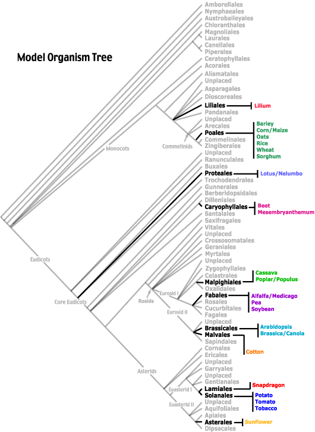

\widowpenalties 1 10000
\raggedbottom
\newpage

# Week 2: Vegetative Morphology & Keys

## The Nature of Leaves

Flowering plants are the culmination of an amazing cascade of evolutionary innovations. 
This laboratory aims to place them in the
context of the diverse array of vascular plants and trace the evolution
of some basic aspects of their morphology. 

The first section of this
laboratory aims to illustrate the less specialised organisation of the
plant body found in the non-flowering plants and from which angiosperm
morphology has been derived, while the latter part of the lab introduces
the use of identification keys. The rest of the course concentrates on
the flowering plants, and will consider form and function of the various
organs of this group in more detail.

The purpose of many of the questions in this lab is to encourage you to
look carefully at your material to see what is really there.  Today's focus is on
**leaves**, **buds**, and **stems**.  In different species they make look very different. There are also some specialized terms for discussing different types of leaves; it's not necessary to memorize these terms but it is good to know they exist and where to find definitions when you need them.   

In today's lab we will do a very brief tour of leaves across all the major groups of vascular plants 
from whisk ferns, ferns, gymnosperms, and finishing with the angiosperms.

##A basal group of ferns: the whisk ferns

The earliest known vascular plants consisted of a system of cylindrical
axes. The cortical tissues of the above ground parts had stomata and a
cuticle and were photosynthetic, while the epidermis of the underground
parts had no cuticle but produced hair-like outgrowths to aid absorption
of water and minerals. Such plants are only known from the fossil
record, but there are two living genera that approach this simple level
of organisation. These are *Psilotum* and *Tmesipteris*, which are both "whisk ferns" and native to
Australia.

###Examine *Psilotum nudum*. 

It consists of a stem system bearing small *microphylls*. The stem grows by a single apical "initial" rather than a meristem (a group of initials).

- Examine the branching of the stem. This type of branching, where there is no main axis bearing laterals, is termed **dichotomous**. It is the oldest form of branching in plants, and is still common in the algae.  Can you distinguish a main axis bearing lateral branches, or are all branches of equal size and growth? 

\vspace*{3\baselineskip}

- Determine what, if any, relationship exists between microphyll and branch position. Does this plant have axillary buds? If there are no actual buds, from which point and in what manner do branches form?

\vspace*{3\baselineskip}

- Are apical buds present? Check the definition of bud in the glossary.  

\vspace*{3\baselineskip}

- How do you think new aerial stems are produced from below ground?

\vspace*{3\baselineskip}

- What would be the effect of browsing or pruning the tips of the aerial parts of the plant?

\vspace*{3\baselineskip}

\newpage

## Ophioglossoid Ferns

Members of this group have roots, stems and leaves, but the latter are *megaphylls*, and are not homologous with the microphylls of the previous group. In the ferns there is no main root system, the roots being lateral organs borne on the stems (*adventitious* roots).

### Examine *Lygodium scandens*. 
The stem grows horizontally below the surface of the ground (it is a *rhizome*); only
the leaves are visible. Each leaf grows for one year, climbing on other
plants towards the light, but eventually dies back to be replaced by a
new one the next year.

- Do the leaves show determinate or indeterminate growth?

\vspace*{3\baselineskip}

-  Note the growing apex of a leaf is coiled up to protect the initial
    cell that is responsible for the growth. All fern leaves uncoil at
    the apex like this  why is this adaptive?

\vspace*{3\baselineskip}

-  Use the drawings in Figs.1.1. and 1.2 to identify the primary and
    secondary leaflets (*pinnae* and *pinnules*), and the primary and
    secondary *rachises*.

\vspace*{3\baselineskip}

-  How would you describe the primary branching in the leaf? Is there
    any evidence of dichotomous branching in these leaves?

\vspace*{3\baselineskip}

-  Note that the veins in the leaflets (pinnules) are in the form of an
    open system where the branches end blindly rather than joining to
    form a net.

\vspace*{3\baselineskip}

-  What, if any, part of *Psilotum nudum* would be homologous with the
    leaf of *Lygodium scandens*? Is any organ of the latter homologous
    with the microphylls of the former?

\vspace*{3\baselineskip}

### Examine *Gleichenia* sp. 

Note the small fibrous adventitious roots that arise at any point along the stem, and the large divided (compound) megaphylls. These leaves uncoil during growth.

-  Determine the relationship (if any) between leaf positions and
    branching of the stem. Does this species have axillary buds? How are
    branches initiated in the stem system?

\vspace*{3\baselineskip}

- Use the diagrams in Fig. 1 to determine what type of branching is present in the leaf. How many orders of branching are there in a leaf? Identify the primary, secondary and tertiary rachises.

\vspace*{3\baselineskip}

-  Compare a one-year-old leaf with a two-year-old leaf. Is there any
    evidence of indeterminate growth in these leaves?

\vspace*{3\baselineskip}

-  Examine the apex of the rhizome (underground stem). Does this plant
    have an apical bud? Is there any protection of the growing apex?

\vspace*{3\baselineskip}

## Gymnosperms

These are seed plants without fruit or flowers. They are thought to have dominated the world's vegetation during the cooler and drier period that followed the Carboniferous.

### Examine *Podocarpus elatus* 

*Podocarpus elatus* (Plum Pine) is a conifer native to the closed forests of eastern Australia. 

The leaves of conifers are also interpreted as megaphylls, i.e. as having evolved from
a lateral branch that has become determinate in growth and flattened to
enhance interception of light.

- Note the simple leaves that characterise the order. Are the leaves strictly determinate in growth? How are they arranged? What term(s) best
 describe the **phyllotaxis** (leaf arrangement)?

\vspace*{3\baselineskip}

- Hold a leaf up against the light and examine the pattern of the veins
 with a hand lens. Can you detect any lateral veins branching from the
 midrib? These leaves have a continuous sheet of tracheid-like cells
 between the adaxial and abaxial mesophyll tissue that distributes water
 laterally through the lamina from the single midvein.

\vspace*{3\baselineskip}

- Examine the pattern of branching of the stem. Look for axillary buds in leaf axils. Does this plant have axillary branching as in angiosperms or apical
 branching as in ferns?

\vspace*{3\baselineskip}

 Examine the growing apex closely. Rather than a naked apical meristem, this group has the meristem protected within a bud. Note that the bud consists of a meristem enclosed with embryonic leaves, but that these are themselves enclosed within a group of **bud scales**, ie., reduced and hardened leaves that protect the bud. When the apex starts growing next spring, the bud scales fall off (leaving scars where they were attached) and the new vegetative leaves expand as the stem grows out of the bud. The positions of previous **winter buds** can be seen at intervals down the stem. They appear as rings of scars where the bud scales were attached.

- Given that each winter bud marks the end of a year's growth, how old is the basal internode of the specimen you are examining?

\vspace*{3\baselineskip}

## Angiosperms -- Flowering Plants

**Fill in the appropriate information in Table 1.1 and 1.2 as you examine the angiosperms in the lab today.**

There are many orders of flowering plants. All are characterised by the
possession of a carpel, pollination at a distance from the micropyle of
the ovule, and double fertilisation via a pollen tube. Like the previous
two divisions their leaves are megaphylls, although there is some
evidence that the megaphyll evolved separately in each group. Unlike
conifers, the leaves of angiosperms may be simple or compound.

###Examine *Abelia triflora* 

Note that it has simple leaves with a short petiole, and that the laminas of these are mostly arranged in the one plane, spreading out either side of the stem. Note carefully how leaves are attached at successive nodes.

-  Which term(s) (see Fig. 1.2) best describes the phyllotaxis (leaf
    arrangement) of Abelia?

\vspace*{3\baselineskip}

- Using a hand lens and holding the leaf against the light, examine the
 venation pattern in the leaf lamina.

\vspace*{3\baselineskip}

- Are there any free vein endings in the leaf? Which term best describes
this pattern? How does this pattern differ from that in the leaflet of a fern? 

\vspace*{3\baselineskip}

- Examine the relationship between stems, leaves and branches. How do
    branches arise on the stem? Does this plant have axillary branching?
    Does each leaf axil contain a bud? How can you distinguish a branch
    of Abelia bearing two rows of simple leaves from a single pinnate
    leaf?

\vspace*{3\baselineskip}

### Examine the  the pea seedlings (*Pisum sativum*) on your bench. 
    
Each leaf is compound, consisting of a petiole terminating in a rachis bearing several pairs of rounded leaflets.

- Which term(s) best describes the form of these leaves (see Figs. 1.1 and 1.2).

\vspace*{3\baselineskip}

- Identify the pair of large rounded stipules associated with each
    node, and resembling a basal pair of leaflets that are attached
    directly to the stem. Note how they enclose the apical bud of the
    main axis. What possible adaptive value could these stipules have?

\vspace*{3\baselineskip}

-  Which term(s) best describe the phyllotaxis (leaf arrangement - see Figs. 1.1 and 1.2).

\vspace*{3\baselineskip}

-  Does this plant have axillary buds?

\vspace*{3\baselineskip}

### Examine *Acacia elata* (Cedar Wattle).

How much constitutes a leaf? Look for axillary buds that may arise in the axils of leaves, but never in the axils of leaflets. Also look for the largest repeated unit of organisation. The leaf is the largest determinate unit of organisation, as distinct from the indeterminate stem system.

-  Identify the petiole, rachis, primary leaflets (pinnae) and
    secondary leaflets (pinnules). Are the primary and secondary
    leaflets strictly paired? 

\vspace*{3\baselineskip}

    
- Is there a terminal leaflet on the primary
    rachis? 

\vspace*{3\baselineskip}

- Is there a terminal secondary leaflet on the secondary
    rachises? 

\vspace*{3\baselineskip}
    
- Which term(s) best describe the form of these compound
    leaves? (see Fig. 1.2).

\vspace*{3\baselineskip}

-  Are there stipules present?

\vspace*{3\baselineskip}

- Look for the doughnut- or volcano-shaped glands (**nectaries**) that
    are a characteristic feature of the petiole and/or the rachis of
    *Acacia* species. What could be the adaptive value of such
    nectaries?

\vspace*{3\baselineskip}

- Compare the form of these leaves with those of *Gleichenia*. In
    which respects do they differ? Which of these two forms of leaf most
    closely resembles a stem system? (ie., which is the more primitive
    megaphyll?) Which features of the *Acacia* do you consider to be
    advanced, and which do you consider primitive?

\vspace*{3\baselineskip}

### Examine specimens A, B, and C

In some angiosperms the process of adaptation has blurred the
    functional distinction between leaves and stems. Some such examples
    are considered below.

In each of specimens A, B and C, use your knowledge of the
    relationship between stems, leaves and axillary branches to work out
    what constitutes a leaf, and then enter in Table 1.1 the appropriate
    terminology from Fig 1.2 to describe the form and arrangement of the
    leaves.

 In the following cases, some part of the plant has been modified to serve as an aid to climbing.

Examine the **tendrils** on the young pea plants supplied. Each
     tendril arises from near the end of a compound leaf, in the
     position in which you find a leaflet (CHECK THIS) on a leaf that
     has no tendril.

 Hence, we can conclude that the development has been modified so that
 the tissues that normally develop into the leaflet grow into a tendril
 instead (ie., the tendril is a modified leaflet/pinna).

 Now examine the tendrils on the branch of *Cissus* sp. Each arises
 on the stem opposite a leaf. This suggests that the plant originally had leaves in
 opposite pairs, and that one has been modified to form the tendril.

 To check this explanation, find a node at which no tendril has been
 formed.

- Does this node bear a pair of leaves, or a single leaf? 

\vspace*{3\baselineskip}

This shows
 that our initial interpretation is wrong. The tendril cannot be a modified leaf.

 - Is the tendril in the correct position to have arisen from an axillary bud?

\vspace*{3\baselineskip}

 If it is neither a modified leaf nor a modified axillary branch, it
 must in fact be a modification of the tip of the main axis.

 In this species, each time a tendril is formed it uses up the apical
 meristem in the apical bud, so continued growth of the plant can only
 come from an axillary bud emerging from the axil between the last leaf
 and the tendril. As it grows, the axillary branch pushes the tendril
 to the side, and forms a continuation of the vertical axis of the
 plant. So the plant axis is formed by a new "side branch" at each node
 bearing a tendril. This pattern of growth is described as **sympodial
 growth**. Sympodial growth is also seen in some plants where the
 apical bud is used up to form a flower.

### Examine specimens D, E and F  

Determine in each case whether the climbing structure (tendril or claw) 
	represents an apical bud, and axillary bud, a leaf or part of a leaf. 
	Enter your answers in Table 1.2.

\newpage

 **TABLE 1** Leaf morphology in angiosperms.  For form of leaf write down the shape, apex, base, and veneation using the terms from Figure 1.1 and 1.2.

  \vspace*{3\baselineskip}

**Species \hspace{20 mm} Form of Leaf\hspace{20 mm} Arrangement of leaves \hspace{15 mm} Stipules** 

  \rule{\textwidth}{1pt}        
 *Abelia triflora*  
   \vspace*{4\baselineskip}
  
  \rule{\textwidth}{1pt} 
  *Pisum sativum* 
  \vspace*{4\baselineskip}
  
  \rule{\textwidth}{1pt}    
  *Acacia elata*            
  \vspace*{4\baselineskip}

 \rule{\textwidth}{1pt}    
 Specimen A          
  \vspace*{4\baselineskip}
  
 \rule{\textwidth}{1pt}    
  Specimen B           
  \vspace*{4\baselineskip}

 \rule{\textwidth}{1pt}    
  Specimen C           
  \vspace*{4\baselineskip}

  \rule{\textwidth}{1pt}    

\newpage

**TABLE 2** Modifications to aid climbing. For form of leaf write down the shape, apex, base, and veneation using the terms from Figure 1.1 and 1.2.

 \vspace*{3\baselineskip}

**Species \hspace{13 mm} Form of leaf  \hspace{10 mm} Modification to aid climbing \hspace{10 mm}Organ modified**

  \rule{\textwidth}{1pt}        
 *Specimen D *  
   \vspace*{4\baselineskip}
  
  \rule{\textwidth}{1pt} 
  *Specimen E* 
  \vspace*{4\baselineskip}

  \rule{\textwidth}{1pt}    

**Check your answers with demonstrators / lecturers / classmates**

\newpage

## Introduction to the use of an identification key

	**Plant identification is a key skill from this course. 
	 This skill is essential in a range of careers
	 including consultancy, bush regeneration, government and research**

Plant identification almost always is based on a key.  The aims of this exercise are to learn how to use an identification key, and also to become familiar with a range of common vegetative features of plants. Use the preceding section and the glossary to understand all the terms in the key.

A key is a device that progressively eliminates
possibilities until the identification is complete. At each step in the
process it asks you to choose which of a pair of contrasting conditions
or characters occurs in your specimen, and then directs you to the next
appropriate choice depending on the condition chosen. It is important to
realise that you do **not** have to use all the possible alternatives
for any one specimen. The contrasting alternatives can be arranged in
either of the following ways:

 1. In **Bracketed Keys** the contrasting alternatives are placed together, usually under a single number. Each alternative directs you to the numbered alternative that should be examined next. Hence, the first alternative under number 1 might direct you to 2 (the second pair of contrasting conditions), while the second alternative under 1 may direct you to 13, omitting all the intervening pairs (2 to 12).

2. In **Indented Keys** the contrasting alternatives are marked with the
 same symbols (numbers or letters) and indented or inset the same
 distance from the left hand margin, but are not necessarily placed
 directly under each other; indeed, they can sometimes be on different
 pages of the book, so one has to search for the alternative. Commonly
  the first and second alternatives are distinguished as A and \*A, B
 and \*B, etc. Having decided which alternative best fits the specimen,
 proceed to the pair of alternatives that immediately *follows* the
 correct alternative (**downwards!**). Hence, if your specimen fits the
 second of two alternatives, say \*B, ignore all the choices listed below
 B and go to the first choice listed under \*B.

In **both** types, it is essential to -

1. always proceed downwards;
2.  **read all alternatives carefully** **before** deciding which best fits the specimen, and check any unfamiliar terms in the glossary. **Never** decide that the first alternative is correct before you read the second of the contrasting pair!

 Now turn to the key at the back of the lab manual. This is a key that uses only
vegetative characters. The advantage of such a key is that it does not
 require you to have flowers or fruit, which are only on the tree in
 certain seasons. Use this key to identify at least two of the
 specimens.
 
 \newpage

# Week 3: Floral Morphology and Inflorescences

Reference: Raven, P.H., Evert, R.F. & Eichhorn, S.E. 2013. **The Biology
of Plants 8$^{th}$ edition** pp 478-492.

In this practical, we will examine the floral characters of typical
angiosperms. In addition, we will introduce you to sufficient
terminology that you can use identification keys based on reproductive
characters.

The radiation of floral structure within Angiosperms has lead to a wide variety in both floral structures and inflorescences.
In part this is due to chance evolutionary events and in part it is do to selection pressures that arise from a particular pollination mechanism.  
Sometimes the pollinators are animals that are evolving themselves, meaning the evolution of floral
structure can only be understood in the context of *co-evolution*--both the plant and the animal are evolving 
at the same time and in response to each other.  

The floral diversity in angiosperms is staggering, but with some practice it's also useful---it can be of great assistance in plant identification.
With a few terms and some practice.  

##Floral structure

As you will see, flowers are complex, highly specialised, and exhibit
tremendous morphological diversity across taxa. Botanists have a number
of ways of describing floral structure.

The basic floral structure comprises four **whorls**, each comprising 3-5 segments, but this varies greatly among species. A 'whorl' is a group of appendages arising from the same point on an axis. The identity of each floral whorl is determined by its position and function. The inner-most and upper-most whorl is the gynoecium, followed by the androecium, corolla and calyx (the outer-most and lowest whorl of the flower.

### Important terms

Make sure you know these terms
(consult the glossary at the back of the manual):

1. determinate and indeterminate growth

2. radial and bilateral symmetry

3. perianth, petal, corolla, sepal, calyx

4. ovary, ovule and ovum

5. carpel and gynoecium

## Floral formula

**A floral formula** can express the number, fusion and insertion of
floral parts.

The symbols used are as follows:

- **K** : calyx (sepals)

- **C** : corolla (petals)

- **P** refers to the perianth, when calyx (**K**) and corolla (**C**) are not different.

- **A** : androecium i.e. the number and arrangement of stamens and staminodes.

- **G** : gynoecium i.e. the number and arrangement of carpels.

- **G** $_{\underline{4}}$ : a line under the number for G indicates a superior ovary

- **G** $_{\overline{3}}$ : a line over the number for G indicates an inferior ovary

- **\*** : radially symmetric flower ie. actinomorphic

- .|. : bilaterally symmetric flower ie. zygomorphic

- \(5) signifies fusion of parts in the same whorl;

- [C$_5$+A$_5$] or C$_5$+A$_5$ indicates fusion between the parts of different whorls.

For example, the floral formula:

\* K$_{5}$ [C$_{(5)}$ A$_{5+5}$] G$_{(\underline{3})}$
  
signifies a radially symmetrical flower with 5 free sepals, 5 fused
petals, 2 whorls each of 5 stamens that arise from the inside of the
petals, and 3 fused carpels with a superior ovary.

Cut a longitudinal section through a flower to determine whether the
ovary is superior or inferior. Cut a cross section through the basal
part of the flower through the ovary to determine the number and
arrangement of the carpels (locules). Then gently squeeze each section
of the ovary. If the ovules pop out of one end then you can assume that
they must be attached at the other end.

**A floral diagram** is a ground plan that can express number of
    parts, fusion and some of the symmetry, but not whether the ovary is
    superior or inferior. It helps to draw concentric circles for each
    whorl first in light pencil as a guide for the floral diagram. The position
    of the inflorescence axis and the subtending bract or leaf can also
    be shown. The figures and show examples of floral diagrams and
    floral formulae

![ A floral diagram of *Flindersia*, a rainforest tree of
 northern NSW. Note that each successive whorl is offset by the same
 angle. This alternation of whorls is a feature of virtually all
 flowers. There is an outer whorl of fertile stamens (the five lobed
 anthers between the petals) and an inner whorl of sterile staminodes
 (the five circles opposite the petals). Fusion is shown by joining
 parts with a line (as for the sepals). Note that the petals are shown
 to overlap, the stamens in the inner whorl are reduced and sterile,
 and the 5 locules show axile placentation. These points are not
 indicated in the formula.](floralDiagram.png)

![Terminology for describing the position of the ovary in
relation to other floral parts.  The hypanthium (shown in black)  is an extension of the pedicel (flower stalk). For every new flower you examine, check if the calyx, corolla and androecium separate from the hypanthium above (epigynous), level with (perigynous) or below (hypogynous) the gynoecium.  Also check if the ovary fused to the hypanthium only at its base (superior), for its basal portion (half-inferior) or for its entire length (inferior).](ovary_position.png)

\newpage

##Inflorescences

Species in which the flowers arise singly in the axil of leaves on
ordinary vegetative branches are usually considered to have the
primitive flower arrangement. Mostly, specialised flowering branches
called inflorescences are produced. There is considerable variation in
the pattern in which flowers are borne on inflorescences. The more an
inflorescence differs from an ordinary vegetative branch, the more
highly evolved it is usually considered.

- The inflorescence on *specimen A* is said to be *anthotelic* (ending
 in a flower), because the growing apex of the inflorescence axis is used
 up to form a flower, and subsequent growth is from lateral branches. The
 pattern of branching and the length of the internodes within the
 inflorescence are used to define sub-types (see figures). Which sub-type
 of the anthotelic inflorescence is this?

- *Specimen B* has a *blastotelic* inflorescence (ending in a branch
 or vegetative bud). The apical bud of the inflorescence axis is not used
 to form a flower, and so the inflorescence is potentially indeterminate:
 ie. it could continue to grow indefinitely. Hence these inflorescences
 often do not have such a precisely defined size as anthotelic ones. When
 the axis of the inflorescence reverts back to vegetative growth at the
 end of the flowering season, the inflorescence becomes *intercalary*
 rather than *terminal* on the plant (ie. within a branch, rather than on
 the end of a branch). Which of the sub-types of the blastotelic
 inflorescence is this (see figures)?

- A mixture of branching patterns may occur within the one
 inflorescence. These are described in order of branching eg. a raceme of
 cymes - the cyme is the terminal form (see figures). Describe the
 inflorescence in specimens *C,* *D* and *E*. Record each in the form of
 a line diagram, as in Fig 3.9. Note carefully whether the flowers are
 sessile or have a peduncle.

## Diversity of floral traits

### Examine the floral structure of the specimen provided.

 **Perianth.** 
 
 - How many whorls of perianth are present? If there is
 more than one whorl, do they alternate in position as in Fig 3.1? Are
 they differentiated into calyx (sepals) and corolla (petals)?

\vspace*{3\baselineskip}

 - How many parts are present in each whorl?

\vspace*{3\baselineskip}

 - Are the petals free from the base or are they fused into a tube? Do
 they arise from the base of the ovary or from above the ovary? Is the ovary
 **superior** or **inferior** (see figures)? Would you describe the
 flower as hypogynous, epigynous or perigynous?

\vspace*{3\baselineskip}

 **Androecium  - the male part of the flower comprising one or more stamens, each with an anther and filament** 
 
 - Does the number of stamens relate readily to the
 number in each perianth whorl, or is it very large and variable from
 flower to flower? Can you determine a constant number of stamens for the
 flower?

\vspace*{3\baselineskip}

 - Do the stamens arise from a rim-like extension of the receptacle at
 the top of the ovary by individual stalks, from the top of a staminal
 tube formed by fusion of the stalks (see figures), or from some distance
 up on the inner surface of the petals? The stamens may appear to be
 all on the one whorl, but often we can distinguish inner and outer
 whorls by their position in relation to the petals (see Figures).

\vspace*{3\baselineskip}

 **Symmetry.** Study the symmetry of the flower from above. 
 
 - Is there more than one axis of symmetry? Are the parts of each whorl all of the
 same size? What type of symmetry is shown: **radial** or **bilateral**?

\vspace*{3\baselineskip}

 **Gynoecium - the female part of the flower comprising one or more carpels, each with an ovary, style and stima.** Note the single style arising in the centre of the
 flower. The structure of the ovary is often seen more clearly in
 developing fruits. Cut the ovary transversely with a razor blade and
 examine the cut surface with a hand lens. Make certain you have cut
 through the centre of the ovary, and not above or below it. You should
 be able to see several ovule-containing regions (**locules**) separated
 by thin radial walls. The ovules will appear to radiate from the
 **placenta**. Otherwise, if you gently squeeze the ovary, the ovules
 will pop up from the surface, but some will remain attached to the
 placenta. Is the placenta on the outer wall or at the centre of the
 ovary? How many locules and placentas are there? Use this information to
 determine the number of carpels in the gynoecium.

 - Is the flower **apocarpous** or **syncarpous** (see figures)? Which
 term in that figure describes the placentation?

\vspace*{3\baselineskip}

 Now determine the position of the locules in relation to the other
 parts in the flower. Does the centre of each locule lie opposite a sepal or in
 between two sepals (ie., opposite a petal)? Note the pattern of
 alternating whorls of floral parts (sepals, petals, stamens and
 carpels).

 **Floral diagram.** Draw enough concentric circles for the whorls of
 perianth and stamens, making the diameter of the inner one at least 4 cm
 so as to leave plenty of room in the centre to draw in the gynoecium
 later. Draw in the perianth on the outer whorls, following the most
 appropriate example in the flower figure.

 Draw in the stamens as lobed anthers (to distinguish them from sterile **staminodes**; see figures), making certain to position each stamen
 correctly with respect to the perianth members. If the stamens are
 fused with the perianth, join the anther to the appropriate perianth
 part (inner or outer) by a straight line (see figures).

 Draw the gynoecium in the centre of your floral diagram. Use **two
 lines,** one for the outer wall of the ovary and another for the walls that divide the
 locules. Show some ovules attached to the placenta in each locule of
 the ovary (see figures).

- Cut a second flower of the specimen vertically along a diameter that
    divides the flower symmetrically. Note how the ovary is positioned
    in the flower with respect to the receptacle and point of attachment
    of the stamens, etc. Would you describe the flower as
    **hypogynous**, **perigynous** or **epigynous** (see figures)?

\vspace*{3\baselineskip}

- Now summarize the floral structure in a floral formula.

\vspace*{3\baselineskip}

## Identifying unknown plants

The following summarises the way you should proceed to identify any
unknown specimen. First determine if the plant is a monocotyledon or a dicotyledon. If the
specimen is a monocotyledon, have a closer look  if it has
modified/reduced flowers and/or spikelets, go to the family key to
determine if it belongs to **CYPERACEAE** or not. If the specimen has
well developed flowers, use the full family key for
monocotyledons to determine in which family the specimen belongs.

If the specimen is a dicotyledon, first check whether it belongs to one
of the major families or subfamilies you should recognise. Only if it does not belong
to one of these families should you use the key to families. Otherwise,
go direct to the key to genera in the family you have recognised.

-  Hold a leaf up to the light and examine with a X10 lens for the
    presence of translucent oil glands.

    - If oil glands are present the specimen belongs to...**MYRTACEAE** or **RUTACEAE**

    - If the ovary is superior, it belongs to.................................**RUTACEAE**

    - If the ovary is inferior, it belongs to................................**MYRTACEAE**

>*If the leaves are compound, it must be a member of Rutaceae. Simple leaves occur in both families.*

If there are no oil glands in the leaves, then continue through this key.

- Examine the inflorescence. Is it a capitulum? That is, does it
 consist of many small tubular flowers without sepals, but the whole
 cluster surrounded by numerous bracts resembling sepals.

    - If so, it belongs to................................................**ASTERACEAE**.

> *Check that the ovary is inferior, the corolla is tubular, and the
anthers are connate and epipetalous to confirm the identification.*

If the inflorescence is not a capitulum, then -

- Are the flowers in dense heads without an involucre of surrounding bracts? Are the stamens the main display of the flowers? Does the plant have bipinnate leaves or phyllodes? Look for the marginal gland. Is the
 fruit a legume or pod?

    - If "yes" is the answer to all these questions, the specimen belongs in........**MIMOSOIDEAE.**

If these features are not present, then -

- Examine a flower externally. Are both sepals and petals present or is there only one perianth whorl?

    - If there is a single perianth whorl of 4 parts, it is........**PROTEACEAE**.

> *Check that there are 4 stamens opposite the perianth parts to confirm
> the identification.*

If this does not apply, then -

- Is the flower radially symmetric and does it have a tubular corolla?

- If so, are there small bracts resembling sepals below the calyx?

    - If so, it belongs to.......................................**ERICACEAE**.

> *Check leaf venation and for epipetalous stamens to confirm the
> identification.*

- If the flowers are zygomorphic, do they have a 'standard', a 'keel' and 2 'wings'? Is the fruit is a legume or pod developed from a superior ovary?

     - If so, the specimen belongs in the ..................................**FABOIDEAE**.

> *Compound leaves and stipules are common in this subfamily.*

If none of these features apply, then go to the family key.

Get used to using these key characters to recognise the large Australian
dicotyledon families. This skill will be tested in the practical exam. It will frequently enable you to
avoid having to wade through the family key because you can go directly to the generic key in that
family.

### Introduction to the use of the Key to Plant Families

 Use The key to some Australian Plant families found at the end of
 the lab manual to identify the specimen supplied to family level.

 First, examine the flower and construct a floral formula for it. Drawing a floral diagram or a vertical cross-sectional diagram may help. Check
 this with a demonstrator, so that you are sure you have interpreted
 the flower correctly, **before proceeding to the key.**

 It is essential to read **both** alternatives carefully before
 deciding which one fits the specimen. Check every unfamiliar term in
 the *Glossary* at the back of this book. At each stage, one
 alternative must fit the specimen. If neither is correct, you must
 have made a mistake in an earlier choice, so check each preceding
 choice.

 Always proceed **downwards** in the key. Chose the correct alternative
 of a pair and then go to the **next pair below the correct one**.
 Proceed until the chosen alternative is linked to the name of a
 family.

 When you have a family name for the specimen, check with a
 demonstrator

 If time permits, identify one of the other specimens provided.

 You should practice using this key whenever you have an opportunity.
 It is a valuable botanical skill and **the use of such keys *will* be
 tested in this course**.

### Plant Identification and Family Descriptions

We will examine the key traits and features of some of the **major
Australian plant families** throughout this course. 

\newpage

# Week 4: Important Plant Families in Australia and the World

There are >300,000 Angiosperms and >350,000 vascular plants, so we use families as the filing cabinet to put all this diversity in.
There are 416 flowering plant families by the most recent assessment (Angiosperm Phylogeny Group IV 2015).  Most working
botanists will know around 100 of these families.  (Not all families are present everywhere.) In this class we'll teach your first 10 families. We will split one of these into two sub-families that look very different.  Some are important in the Australian flora, and others are on the global scale and especially 
for agriculture.  

The important concept to consider first is that some traits are variable within some families, but good diagnostic characters for other families.  So the key traits for different families are different.  Moreover it's the particular combination of traits that makes an family identification accurate.  
Categories of traits that help were covered in detail in the previous two labs, so there are not new terms to 
learn today, but use this opportunity to review those terms.  The terms also are crucial for working your way through plant ID keys.  

Start filling out the trait data for the families below by looking at the specimens.  There is also details for many of these families are provided in the back of the lab manual (Plant Identification and Family Descriptions, and the Key to Australian Plant
Families).  As throughout this course, feel free also use the abundant plant resources on the web for Australian and global 
families (see links on Moodle).  The key skill in this course is connecting the plants you see in front of you to resource material.

One note about names: modern botanical rules state that families should be named after a "type" genus and end in "-aceae".  (Animal families end in -idae.)  That is the Proteaceae is named for the "type" genus Protea (which is found in South Africa and florist shops).  Because this was the first genus of the family it becomes the type genus.  Before these names were introduced there was a bit more chaos in naming of plant families.  (And there are still a few hold-outs around that want to stick to old names.)  We've included the old names below as some of the reference books and field guides still use the old names.  

\begin{table}[]
\centering
\caption{Proportion of Australian species within each of the major families.}
\label{prop-aussie}
\begin{tabular}{c c c}
\hline
Family & Percent of the Australian Flora  & Percent of the World flora \\ \hline
  Fabaceae     &  	12.0  & 7.0\\ 
   Myrtaceae     & 	9.3 & 1.7 \\
   Asteraceae & 	8.0 & 9.4\\ 
 Poaceae    &   6.5 & 3.3\\ 
  Proteaceae   &  5.6 & 0.3\\ 
\end{tabular}
\end{table}

## Myrtaceae

### How will you recognize members of this family?
\vspace*{16\baselineskip}

### Example species

\vspace*{4\baselineskip}

\hrulefill

## Rutaceae

### How will you recognize members of this family?
\vspace*{16\baselineskip}

### Example species

\vspace*{4\baselineskip}

\newpage

## Fabaceae sub-family: Faboideae \small aka Papilionaceae

### How will you recognize members of this family?
\vspace*{16\baselineskip}

### Example species

\vspace*{4\baselineskip}

\hrulefill

## Fabaceae sub-family: Mimosoideae

### How will you recognize members of this family?
\vspace*{16\baselineskip}

### Example species

\vspace*{4\baselineskip}

\newpage

## Proteaceae  

### How will you recognize members of this family?
\vspace*{16\baselineskip}

### Example species

\vspace*{4\baselineskip}

\hrulefill

## Ericaceae \small aka Epacridaceae

### How will you recognize members of this family?
\vspace*{16\baselineskip}

### Example species

\vspace*{4\baselineskip}

\newpage

## Poaceae \small aka Gramineae  

### How will you recognize members of this family?
\vspace*{16\baselineskip}

### Example species

\vspace*{4\baselineskip}

\hrulefill

## Brassicaceae \small aka Cruciferae

### How will you recognize members of this family?
\vspace*{16\baselineskip}

### Example species

\vspace*{4\baselineskip}

\newpage

## Apiaceae \small aka Umbelliferae  

### How will you recognize members of this family?
\vspace*{16\baselineskip}

### Example species

\vspace*{4\baselineskip}

\hrulefill

## Asteraceae \small aka Compositae  

### How will you recognize members of this family?
\vspace*{16\baselineskip}

### Example species

\vspace*{4\baselineskip}

\newpage

#Week 5: Flowering Plant Diversity

In this lab, we will be examining the history of plant diversity.  *Phylogenetics* is the study of diversity through time.  In this lab we will do a practical introduction to the basics of phylogenetics and how it relates to what we've been studying this term.  

First some history: seed plants are about 375 Million years old (Silvestro et al. 2015).  The age of angiosperms is a subject of much recent debate but probably the most recent common ancestor of all angiosperms lived between 150 and 200 million years (Stephens 2001).  

The following paragraph is an excerpt from an influential paper (Davies
et al. 2004):

>Charles Darwin described the rapid rise and diversification within the angiosperms as an abominable mystery. Angiosperms are regarded as one of the greatest terrestrial radiations of recent geological times. The major lineages originated 130-90 million years ago (mya), followed by a dramatic rise to ecological dominance 100-70 mya. Approximately 250000 extant species have been recognised, although estimates vary, and the final number might be double this. Within the group, sister clades can differ in species richness over several orders of magnitude. Darwin attempted to identify a single causal explanation for the rapid diversification of angiosperms but described his own efforts as wretchedly poor.

Through  recent research, we have come a long way in understanding the evolutionary relationship among orders and families  of flowering plants. The figure shows a phylogeny of flowering plants (a
 tree showing how flowering plant orders are related to one another).

\newpage

### Make sure you know the key terms:  

1. **Most recent common ancester** 

2. **Clade** (a group of organisms that contains all descendents from a common evolutionary ancestor; **taxon** (plural: taxa) is a synonym of clade)

3. **Speciation rate** (units of number of species per million years)

4. **Extinction rate** (units of number of species per million years)

5. **Net diversification rate** (units of number of species gained or lost per million years)

6. **Sister group**--Sister groups or "sister taxa" are just what they sound like--two
groups the diverged from each other, with each being the other's closest relative.  Gymnosperms are angiosperms closest relative and vice versa.  The ferns are sister to the seed plants.  Fagales (the oak order) and Cucurbitales (the cucumber order) are sister groups.  However, this gets more complicated as some taxa do not have accepted names.  Rosales is sister to Cucurbitales + Fagales, which is a group that does not have its own name.  

7. **Monophyletic** a group of organisms that contains all descendents from a common evolutionary ancestor; primates is one example of a monophyletic group that contains *you*.  If a plant family is found not to be monophyletic, taxonomists break it up to try to create monophyletic plant families.  This is usually why taxonomy changes through time.  For example the *Acacia* species in Australia and the *Acacia* species in Africa are not monophyletic and taxonomists are currently in the process of breaking them up into two different genera.

8. **Paraphyletic** (hard to explain in words see figure)

9. **Family** in plants these all end in *-aceae*; every family is in an order; in plants families *usually* have diagnostic features

10. **Order** in plants these end in *-ales*; unlike families orders are so internally diverse that there are usually not diagnostic features

\newpage

### Phylogenies can be in different units

There are three key types, so learn to check this when you ``read'' a tree:

1. No units at all.  These are commonly used just to show the shape (ie branching structure) of a tree.  The model organism tree above is like this.

2. Time.  These are called time-trees and have units of (millions of) years.  The Werner et al. tree above is a time-tree.  These are almost always "dated" fixed to certain dates using information from fossils.  

3. Molecular evolution.  In these tree the units are derived directly from the number of changes in the organisms genes.  The Smith et al. 2008 trees are an example.  

Branching structures represent the flow of more than just evolution.  Any idea or design concept often can be represented using a tree.  Here is a fun example, note that it is also a time-tree, that is the y-axis is in units of years:

### Three key web resources that curate data on flowering plant diversity:

The Atlas of Living Australia:  (http://www.ala.org.au/)

and

The Angiosperm Phylogeny Website: (http://www.mobot.org/MOBOT/research/APweb/)

and 

The Plant List: (http://www.theplantlist.org/)

### You will now use these two web resources (and anything else you can find on the web) to build a powerpoint slideshow (4-6 slides!).  

**Make sure to cite the source for all data in your slideshow**

Here are the steps to producing this slideshow:

1. Find one native plant species that is found close to somewhere you know well, e.g. your home.  Pick a species that you like, since you'll proceed to do some research on it.  Everyone should pick a different species.  Don't pick the same one as your neighbor.   (Include in the slideshow the latitude and longitude of the species observation from ALA).

2. Which state(s) is this species found in (check ALA)?

3. Which family is this species in?

4. Write down the traits of the flower (or plant) that would allow you to tell that the plant is in this family.

5. Which order is this species in? 

6. The number of species in this genus in the world (check the plant list).

7. The number of species in this genus in Australia.

8. The number of species in this family in the world. (Is this family relatively diverse or species poor? Is this number of species relatively high or low?)

9. The number of species in this family in Australia. (Is this family relatively diverse or species poor? Is this number of species relatively high or low?)

10. The sister family(s) of your plant's family (check the phylogenies on APWeb).

11. Modeled on the pictures of phylogenies in the lab, draw a phylogeny (with lines in powerpoint or whatever drawing program you like) that contains your plant species, *Zea mays*, *Solanum tuberosum*, *Eucalyptus regnans*, *Pisum sativum*, and *Pinus radiata*. (Remember phylogenies don't have to contain all the species--it's OK to draw a phylogeny of just a few to show the relationships among those 6 species.)

12. Place picture of each plant at the "tip" of the phylogeny (ALA or google image)

13. Remember a phylogeny is a representation of history.  How long ago was the most recent common ancester of all the species in your phylogeny?  Place a rough scale bar (in millions of years) on your phylogeny (hint: look for dates/ages on APWeb)

14. Calculate the net diversification rate for your species' family.  This is the total number of species in the family (get the number of "accepted" species from the plant list) divided by the age of the family.  

### Upload your slideshow on moodle

 \newpage
 
# Week 6: How to be a tree

This week’s class is incredibly important – understanding how plants actually grow (and no, it’s not like what you see in the movies!). 

We need colour pictures to fully capture tissue types, so we will give you a hand out in class that explains this week's material.  

This week we do sectioning and staining and we will use the compound microscope for the first time, and this is a rather complicated piece of equipment.  These are important practical skills for botany specifically and biology in general.  Read the following instructions before you start the practical work in the lab.  

## Sectioning and Staining

Plant structure is studied most often by cutting thin sections of the
plant and examining them stained or unstained with the light microscope.
The plant material to be sectioned may be living or 'fixed', which means
that the material has been treated with a carefully chosen chemical that
gels cell proteins and preserves intracellular structure with as little
distortion as possible of the living state.

Sectioning can be done by hand with a razor blade, or by using a
mechanical cutting device (a microtome) that holds the material and
advances it a section-thick distance after each slice of the knife.
Usually for microtome sectioning material is first impregnated with wax
or plastic which is then solidified around and within the tissue to
strengthen it during cutting. On hardening, a 'block' is formed with the
specimen 'embedded' within a matrix of supporting material. Both tissue
and embedding matrix are sectioned together and the extra support allows
thinner sections to be cut, resulting in better resolution of tissue
structure.

### Sectioning By Hand

You will require:

1. a Petri dish or watch glass with a 0.5 cm depth of water;

2. a small paint-brush;

3. a *new* razor-blade (carefully protect its cutting edge all the time).

Hold the material with your left (or non-dextrous) hand so that the
plane of cutting will be horizontal. The aim is to cut smoothly and
fairly quickly producing dozens of sections from which a few are chosen:
it is worth noting that it is often the incomplete sections with thin
'running-out' edges that provide the best study. The razor blade surface
should be wet with one or two drops of water to prevent the newly-cut
sections from drying out. When several sections mount up on the blade
they are swept carefully off with the wet paint-brush into the water in
the Petri dish.

**Do not let the material dry out at any stage.**

### Staining Schedules

Place the staining solution in a watch glass. Prepare a second watch
glass about 2/3 full of distilled water ready for rinsing. After
staining the specimen for the appropriate time transfer it to the rinse
solution. Note that staining times are usually critical, but sections
can often be held in rinse water for several hours without damage.

**All stains should be treated as potential carcinogens and you should
take care not to stain yourself. To protect skin and clothes from
accidental staining please wipe up any spills immediately.**

Schedules for the stains you will use are outlined below.

### Mounting Sections

Always place a cover-slip over the section before examining it under the
microscope. Sections can be mounted either in water or 50% glycerol. The
advantage of glycerol is that it evaporates less quickly. However, if
the preparation is drying out an additional drop of mounting solution
can be added easily without removing the cover-slip, by carefully
touching the drop (on a needle, pencil or pipette) against the edge of
the cover-slip and allowing the liquid to flow under the cover-slip.

(Plastic-embedded sections are often mounted in oil or other non-aqueous
media, rather than water: this gives improved resolution.)

### Staining Schedules

- *Toluidine Blue* (MULTIPLE STAIN)

Toluidine Blue is a very important dye that distinguishes lignified
 from unlignified walls. It is a positively charged dye which stains negative groups.
 Lignified walls stain blue and unlignified walls stain pink or purple.
 The pectin and hemicellulose fractions of the wall stain pink.
 Cellulose does not stain.

More detailed staining reactions are given below:

### Cell Chemical Group That Staining Structure Reacts With Colour

1.  cytoplasm (phosphate groups in nucleic acids) purple

2.  nucleus (phosphate groups in DNA) blue

3.  cell walls (COOH groups in some unlignified carbohydrates e.g. pectin) pink

1.  lignified walls (phenols) green to blue (turquoise blue)

2.  some vacuoles (phenols) deep dark blue

### Staining Schedule

1. Wash section in distilled water (5 min.).

2. Transfer to a drop of toluidine blue in a watch glass.

3. Leave until you can see differentiation of pink and blue tissue (seconds to minutes).

4. Transfer to distilled water in a second watch glass for a few seconds to wash out excess stain. Check stain. If OK, then

5. Transfer to a clean dry slide in a drop of glycerol. Cover with a clean cover-slip, lowered gently from one side to exclude air bubbles.

### Safranin and Fast Green

Many prepared slides are stained with these two dyes. Safranin (red) is
preferentially retained in lignified, suberized, or cutinised walls, as
well as in regions rich in DNA or RNA (ie. nuclei), whereas Fast green
stains protein (and, particularly, primary walls). Both stains are also
fast (ie. permanent) on clothing and to a lesser extent on fingers, so
should be used with care, and any spills mopped up with paper towel.

### Iodine in KI (STARCH)

- Iodine stains starch grains bright purple to blue-black.

- Wash briefly in distilled water.

- Transfer section to a drop of iodine on a slide.

- Leave for 2-5 minutes.

- Blot off the stain and add a drop of glycerine.

- Cover with a cover-slip, lowered gently from one side to exclude all air bubbles.

**Note:** Although Iodine is widely used as a disinfectant, some people
are highly allergic to it. Treat all stains with care and do not allow
them to come in contact with your skin.

## Light Microscopy

### Olympus Microscope

**Operating procedure**

1. Place the microscope in a comfortable position on the bench.

2. Check that on/off switch (right hand side of base) is in the off
position and the brightness control is at zero.

3. Plug in and switch on at the centre of the bench.

4. Turn on microscope lamp and increase brightness control until you can
see some light coming through the condenser.

5. Make sure the 4x objective is in position.

6. Place specimen slide on stage and hold in position with stage clip.
THE SPECIMEN SHOULD NEVER BE VIEWED WITHOUT A COVERSLIP.

7. Position specimen under 4x objective using mechanical stage controls.

8. Focus. Adjust brightness control if necessary.

9. Make interpupillary and diopter adjustments (see below).

10. Swing in desired objective. Re-focus.

11. Check that condenser height is optimum (should be raised above image
of ground glass screen).

12. Close iris diaphragm to 2/3 (70%) of the exit pupil of objective
(see below).

13. Fine focus and observe.

**Correct setting up of the microscope *will be examined* in the
practical examination.**

*How to correct interpupillary distance and diopter settings*

1. Hold the knurled dovetail slides of the right and left eyepiece tubes
with both hands and put the tubes together, or pull them apart
laterally, whichever is required, while looking through the eyepieces
with both eyes, until perfect binocular vision is obtained.

2. Rotate the tube length adjustment ring on the right eyepiece tube to
match your interpupillary distance setting, which is given on the scale
above and left of the right hand eyepiece.

3. Look at the image through the right hand eyepiece with your right eye
and focus on the specimen with the coarse and fine adjustment knobs.

4. Next, looking at the image through the left eyepiece with your left
eye rotate the tube length of this eyepiece to focus on the specimen
without altering the coarse and fine adjustment knobs.

### Automatic pre-focussing

This lever (inside ring of left hand focusing knob) locks the microscope
at a particular coarse focus position to prevent further upward travel
of the stage by means of the coarse adjustment knob. It prevents damage
to objectives as a result of focusing the specimen slide up through the
objective lens. It does not restrict fine focusing.

### Aperture iris diaphragm

The lever on the condenser controls the aperture iris diaphragm
adjustment. The iris diaphragm should be adjusted to match the numerical
aperture of the objective in use in order to get the best result.
However, since the image usually lacks contrast a compromise is made and
the diaphragm is stopped down to about 70% of the objective numerical
aperture.

Remove the eyepieces: the circle of light represents the exit pupil of
the objective. Adjust the diaphragm using the condenser lever until the
iris impinges on the exit pupil by about 1/3. This should always be done
when objectives are changed.

### Dos and don'ts

1. If lenses are dirty you may clean them, but only with either a blower
brush or a fresh piece of lens tissue - NOT KLEENEX. (Xylene, alcohol or
ether may be used in small amounts as a cleaning fluid.)

2. When carrying the microscope, keep it upright so that the eyepieces
do not fall out. USE BOTH HANDS.

3. The tension on the coarse focus can be altered by rotating the
innermost ring on the right-hand focus adjustment knob.

4. DO NOT TWIST THE TWO COARSE ADJUSTMENT KNOBS IN OPPOSITE DIRECTIONS
SIMULTANEOUSLY AS THIS WILL CAUSE DAMAGE.

5. Do not spill water, oil or acid on the mechanical stage or any other
part of the microscope. Oil or water between the slide and stage causes
friction so that the slide will not move easily.

### Calibration of the microscope and making measurements

*Simple calibration calculations are usually on the board at the front
of the lab.*

All microscopes are equipped with a micrometer eyepiece. This contains a
glass graticule with a scale engraved at the centre. It has been
inserted into the eyepiece and should be visible when you look through
the microscope.

The value of the micrometer eyepiece changes as the magnification
changes and it should be calibrated for each objective with a stage
micrometer. The stage micrometer scale is usually 1.0 mm long,
subdivided into 100 X .01 mm (10 m) divisions. To calibrate the
eyepiece micrometer you need to determine the number of divisions on the
stage micrometer that corresponds to a chosen number of divisions of the
eyepiece micrometer.

The relationship is: $M = \frac{S \times V} {E}$

M is the value (in mm or m) of *each* eyepiece micrometer unit to be
determined.

V is the value of each stage micrometer unit (usually 0.01 mm).

S & E are the numbers of units on the stage and eyepiece micrometers,
respectively, that correspond.

Once the value of M has been determined for a particular magnification,
the eyepiece micrometer may then be used in the same way as a ruler.

The measurement is actually made by carefully lining up the two scales
and counting the number of divisions in each that corresponds. The
calibration should be done for each objective and the value recorded for
future reference.

## Botanical drawing

In this course we are not asking you to produce works of art (or
imagination), but accurate representations of what you can see down the
microscope. You are all capable of this - the principal requirements are
practice and a sharp pencil (preferably HB).

There are two types of drawing, and *each should be accompanied by a
scale:

### High Power Drawing

 This should be an accurate drawing of a small number of cells. It
 should show details of cell outline and as much internal structure as
 is discernable. For example, if you are drawing a cell with
 chloroplasts, you should draw them in the correct position to the
 correct size, shape and number: they should not be drawn as a vague
 collection of squiggles around the edge of the cell. Cell walls, if
 accurately represented, will rarely have breaks in them.

 Thick cell walls should be represented by a double line, and thin cell
 walls by a single line. You can use the distance between the two
 "double" lines to indicate wall thickness. Each cell should be
 enclosed by a completed line. See these points in the example below.
 Note how the thick walls of the epidermis, collenchyma and fibres are
 separated from intercellular space.

 

### Constructing a scale

 A scale must be of a rounded-off length (eg. 10 m, 50 m, 100 m, or
 0.5mm or 1mm) that readily allows the viewer to calculate the real
 size of the whole structure and its parts.

#### STEPS:

1.  Measure (on the section) an *easily recognisable part* of the
    drawing using the ocular micrometer eg. the radial diameter of a vascular bundle = 54 units on the X4
 objective

2. Calculate the actual size: (ie. multiply occular units by the length each represents on the objective used)
eg. 54 x 25 =1350 m (or 1.35mm)

3. Measure the size of *the same part* on the drawing (ie. the diameter of the same bundle) eg. 76mm

4. Since 76mm on the drawing represents 1350m on the section, what
 distance on the drawing equals 1mm (1000m) on the section?

 1 m = *76* therefore 1000m = *76* x1000 = 55.9mm

 1350 1350

5. Draw a scale line 56mm long below the drawing and label it 1mm
 (ie.1000m).

#### General points

1. Make drawings large.

2. All drawings should have a heading stating organ, species and plane
of section.

3. All drawings should be in pencil. It is also highly desirable that
labels should be in pencil so that corrections can be made easily and
neatly.

4. Labels should appear to the side of a drawing and not be written
across it. A *straight* line, and not an arrow, should connect the label to the area it refers to -
the labels should be arranged in such a way that the lines do not cross.
Labels should give detailed information about composition of structures
where possible, based on staining reactions, eg. lignified wall.

5. It is usually not necessary to use cross-hatching or stippling to
indicate particular tissue types in low power diagrams. If you must
clarify your drawings by cross-hatching, make sure it is neat and does
not cross the boundary line of the tissue. An example of the use of
shading is given on page 12.

6. The scale of all drawings should be indicated (see instructions for
constructing a scale above).

7. In labelling a drawing a certain amount of interpretation is
necessary. Under some circumstances, interpretation of certain features of transverse sections
may require confirmation from longitudinal sections.

8. While drawing you should be constantly altering the plane of focus of
the microscope in order to clarify details. You should also be prepared to change the
objective: to a higher power to help the interpretation of fine detail;
to a lower power to appreciate the relationship of what you are drawing
to the structure of the whole organ.

9. In this course we hope to improve your skills of observation and
interpretation. In some exercises it will be left to you (with advice from your demonstrator) to
decide what sections to cut, what stains to use and how to present the
evidence. Drawings alone may be inadequate to record some observations;
supplement by notes or tables when appropriate. It is not desirable to
include too many notes in the labels.

# Week 7: Leaf economics 

In this class, we will examine some of the evolutionary constraints that have influenced the shape and structure of angiosperm leaves. 

Even casual observation of the plants around us reveals an incredible diversity of form and architecture, for example even in the leaves of quite closely-related native plants such as members of the Acacias or Banksias.  What evolutionary forces have generated such diversity?  Why is there not a single 'best' shape and structure for a leaf?  

One way to imagine these problems is to think of alternative investment strategies.  On one hand, a plant may have evolved a strategy of investing considerable amounts of organic molecules to manufacture robust leaves, resistant to physical and herbivore damage.  Alternatively, another species may have evolved a 'throw-away' strategy, investing relatively little carbon in each leaf, but replacing leaves frequently.  

We will examine these questions by analysing the relationship of **leaf mass per unit area**, (**LMA**, the dried weight of a leaf divided by its area) to **leaf longevity** (how long the leaves of each species last on the plant). 

## Exercise 1. LMA versus leaf longevity

1.  Take one leaf from each of seven angiosperm species.  The leaves have been pressed and dried in an oven to remove all water.

2.  Measure the area of each leaf. Record in units of $m^2$.

3.  Weigh each leaf, in grams, on the electronic balance 

4.  For each leaf, divide mass ($g$) by area ($m^2$) to calculate LMA ($\frac{g}{m^2}$). Put your data for each leaf on the whiteboard.  

5.  Plot LMA on the X-axis, against leaf longevity on the Y-axis (you can do this by hand, or using a computer).

\newpage

  SPECIES                     Leaf lifespan (years)   LMA
  --------------------------- ----------------------- -----
  *Eucalyptus umbra*          2.06^1^                 
  *Syncarpia glomulifera*     1.91^1^                 
  *Acacia suaveolens*         2.45^1^                 
  *Hakea dactyloides*         3.45^1^                 
  *Lambertia formosa*         2.48^1^                 
  *Pimelia linifolia*         1.06^1^                 
  *Ocimum basilicum*          0.12^2^                 
  *Platanus* × *acerifolia*   0.67^2^                 

^1^ From Wright and Westoby (2002) New Phytologist 155:403-416

^2^ Pers. obs. A. Moles.

6. Why do you think the points fall where they do, and not elsewhere on the graph?

\vspace*{10\baselineskip}

7. Would you expect deciduous species to have higher, or lower LMA than evergreen species? Why?

\vspace*{10\baselineskip}

## Exercise 2. Leaf structure and function

There are virtual sections of leaves available on Moodle (in the resources folder).

### What does a high LMA leaf look like inside?

Look at the images of *Doryphora sassafras* and *Banksia serrata*.

1. Which species has an LMA of 70?                                

2. Which species has an LMA of 352?

3. What differences can you see between the high and low LMA leaves?

\newpage

### Adaptations to arid environments

Plants lose a lot of water through their leaves. Many Australian plants have to deal with regular droughts or consistently arid environments. As a consequence, these plants have many adaptations to limit water loss. Following the link on moodle, open the images for each of these plants and list the adaptations to water loss that you can see.

1. *Banksia serrata*

\vspace*{10\baselineskip}

2. *Correa alba*

\vspace*{10\baselineskip}

3. *Hakea terretifolia*

\vspace*{10\baselineskip}

4. *Atriplex* sp

\vspace*{10\baselineskip}

\newpage

# Week 8: Fruits and edible botany 

Fruits and seeds play an essential role in the reproduction of most
plants. As well as being reproductive structures they also have
functions in the dispersal of plants, and, in many cases, survival
through periods of adverse conditions. In this practical you will look
at germination in seeds and you are provided with an introduction to
some of the diversity of fruits found in the Angiosperms.

 A range of fruits is provided. Using the Key and descriptions try
to identify the type to which each fruit may be assigned.

Determine whether each fruit is a simple, aggregate or multiple fruit.
If simple, try to find out whether it was the product of a superior or inferior ovary.

Try to determine the number of carpels incorporated into each fruit, and
the placentation of their ovules. For this it may be necessary to start
your investigations by taking a transverse section through the fruit (a
longitudinal section is rarely informative). In many cases fusion and
abortion of parts during development obscures the picture which can only
be resolved if a full developmental sequence from flower to fruit is
available. For example, a coconut is developed from a tricarpellary
ovary in which two of the locules have aborted.

## Fruit Types

>"...it may be right to say that there are as many sorts of fruits as
>there are major groupings of genera. This means thousands of kinds, and
>indeed, several hundred specialised names have already been proposed;
>the result is another specialist language in the babel of science,
>through which the student must break." - E.J. Corner 1964 'The Life of Plants'

The strict definition of a *fruit* would be that it is the product of
the post-fertilizaton development of a pistil. However, it is more
convenient to adopt a functional concept and include as part of the
fruit tissues of extra carpellary origin so that the fruit is the
post-fertilization development of the flower. [In some books you will
find fruit containing tissues of extra carpellary origins referred to as
"false fruit". Thus the strawberry (not a berry but an aggregate fruit)
is said to be a false fruit because the fleshy part is derived from the
receptacle. Even the fruits of *Eucalyptus* are sometimes called false
because, derived from a half inferior flower, the cup of the fruit is
extra carpellary. For most purposes making the distinction between true
and false fruits is unnecessary.]

Several classifications of fruit types have been proposed of varying
complexity. The terminology is, unfortunately, not necessarily
consistent between classifications. Many of the names of fruit types
refer to specialised forms produced by particular families; some of
these special types are of great economic importance so that the names
are widely known, many other special names can be conveniently ignored.

An artificial classification of fruits:

**Simple fruit:** a fruit derived from a single pistil or from a single
carpel disseminated singly.

**Aggregate fruit:** a fruit derived from many free carpels of a
*single* flower.

**Multiple fruit:** a fruit derived from the carpels of many individual
flowers crowded together on the same axis.

### Simple Fruits

A simple fruit is derived from the ripening of a simple or compound ovary in a flower with only one pistil.  Note that there may be more than one carpel and more than one seed within a simple fruit.

 A fruit is **dry** when the pericarp is papery, leathery or woody at
 maturity and **fleshy** if the pericarp becomes succulent or fibrous.
 Dry fruit may be **dehiscent** if the pericarp splits, or opens by
 means of pores, to shed the seeds and **indehiscent** if the pericarp
 does not open.

 Fleshy fruits are virtually all indehiscent.

### Dry dehiscent fruits

 **FOLLICLE** - product of a single superior carpel containing one or
 many seeds and splitting down one side of the fruit only - e.g. *Telopea* (waratah),
 *Xylomelum* (woody pear).

**LEGUME** - product of a single superior carpel containing many seeds
 and splitting at maturity along both sides (along the carpel margins
 and the median-vein). Dehiscence is often explosive, ejecting the
 seeds. This is the characteristic fruit of the Leguminosae (Fabaceae).

**CAPSULE** - fruit developed from a number of fused carpels which
 open along a number of

 sutures or by pores, e.g. *Eucalyptus.* A **siliqua** is the capsule
 characteristic of the Brassicaceae--it is a capsule that
 has two valves (from two fused carpels) which separate from a
 persistent central partition (septum) to which the seeds are attached.

### Dry Indehiscent fruits

 **ACHENE** - product of a single superior carpel with one seed which
 is free from the pericarp except at the placenta, e.g. *Ranunculus*. A
 **cypsela** is an achene derived from an inferior ovary; the term
 appears to be restricted to the Asteraceae.

**SAMARA** - a winged achene; the wing is an extension of the pericarp
 and presumably assists in dispersal, e.g. *Fraxinus* (ash). The fruit
 of the sycamore often given as an example of a samara is really a
 schizocarp (q.v.).

**CARYOPSIS** - product of a unilocular, superior ovary with one seed,
 but the wall of the ovary (pericarp) and the seed coat (testa) are
 fused together; characteristic of the family Gramineae.

**NUT** - one-seeded fruit with a hard, woody pericarp, e.g. *Quercus*
(acorn), *Corylus* (hazelnut). Most of the nuts of commerce are not true
nuts but are the seeds or stones of fruits.

**SCHIZOCARP** - usually the product of several joined carpels which
separate when ripe, but each carpel remains indehiscent. Each carpel
contains one seed, free from the pericarp except at the placenta, e.g.
*Geranium*, the *Apiaceae*, *Acer*. The separate segments are called
**mericarps**. In a sense schizocarps are intermediate between dehiscent
and indehiscent fruits.

**LOMENTUM** - formed from a single carpel with many ovules, that
separates into a number of one-seeded sections - found in a number of
Fabaceae.

### Fleshy fruits

**DRUPE** - the pericarp is differentiated into three zones: an outer
*epicarp*, a middle succulent or fibrous *mesocarp* and an inner
lignified *endocarp*; the endocarp and the contained seed(s) form the
*pyrene* (stone). Most commonly formed from a single superior carpel as
in *Prunus* spp. (peaches, cherries, etc.), but multicarpellary origins
occur, e.g. *Lantana* and sometimes the drupe is pseudomonomerous
through abortion, e.g. *Cocos* (coconut).

**BERRY** - pericarp two-layered, lacking the woody endocarp; usually a
many-seeded fruit formed from a number of fused carpels (inferior or
superior), e.g. *Musa* (banana), *Cucurbita* (pumpkin); sometimes
one-seeded, e.g. *Phoenix* (date), (many so-called "berries" -
strawberry, blackberry, raspberry, are not berries). 

A **POME** is a particular kind of berry characteristic of certain members of the
Rosaceae (apples, pears) - the five inferior carpels are free on their
inner edges (the hole in the core) and their outer walls and the
enlarged enclosing receptacle forms the flesh of the fruit.  Pomes, and berries in general, are often yummy.

###Aggregate fruits

An aggregate fruit is  derived from many free carpels of a *single* flower; the carpels are not joined together, i.e. each pistil contains one carpel.  Often the
 carpels are held together by a persistent floral receptacle which itself
 may be elaborated to form a substantial accessory part of the fruit.

1. *Receptacle tissue not fleshy*, e.g. *Rubus* (raspberry, blackberry)
where the individual fruits are small drupes borne on a non-succulent
receptacle.

2. *Receptacle tissue fleshy*, e.g. *Fragaria* (strawberry) where the
individual fruits are achenes borne on a succulent receptacle and *Rosa*
(the rose) where the rosehip consists of achenes enclosed in a fleshy
cup-shaped receptale (a *hip*).

###Multiple fruits

Multiple fruits are derived from many pistils or carpels of *many individual
flowers crowded together on the same inflorescence* axis. The
inflorescence axis and frequently also the basal parts of all floral
segments as well as the floral receptacle and pedicel are necessarily
incorporated in the fruit)

e.g.:*Syncarpia* (Turpentine) has a fruit formed from a fused cyme with
seven capsules. *Ananas* (pineapple) fruit is a number of fused berries
and the axis of the inflorescence (a spike), the bases of the subtending
bract and the flower stalks have all become succulent.

\newpage

# Week 9: Regeneration ecology: plant population structure and dynamics

In this exercise, we will compare plant population structure between plant species with different life histories and use the data to make inferences about the dynamics of populations exposed to periodic bushfires.

**You will need:** hat and sun protection, sturdy footwear, insect repellent, notebook, pencil. Wet weather gear in case of rain.  Old/field clothing which you don’t mind getting dirty with charcoal or soil.

**Location:**  Small bush track opposite 12 Grose Street, La Perouse. Bus # L94 from UNSW. Part of this site was burnt about 2 years ago. The other part has been unburnt for approximately 20 years.

**Time:** Be on site by 1.30 pm for a briefing about the exercise. We will finish at 5.30 pm.

**Activity:** You will work in pairs, taking turns to search quadrats, count plants and record the data. Two pairs (4 people) will work together, sampling adjacent quadrats (i.e. one quadrat each, side by side).

**Locate sampling points:** Select a random number between 5 and 60 to pace out your steps along the track. Then select a second random number between 2 and 20 to pace into the bush on the burnt side of the track.  At the location of your last step, lay out two 1 x 1 m2 quadrats side by side (one quadrat for each pair of students).

**Record the data:** Read this first and think about how to lay out your data sheet. Record the date, location and names of data collectors. For the five species described below, count the number of individuals present in the quadrat and for each one, measure its height and whether or not it has evidence of reproductive material (flowers or fruit). If there are more than 10 individuals in the quadrat, a sample of 10 height measurements is sufficient. If there are more than 20 individuals in the quadrat, you can estimate the total by counting in multiples of 10. Count live and dead individuals of each species separately.

Select a second quadrat in the burnt area using the same method and repeat the sampling.
Now repeat the procedure to sample two quadrats on the unburnt side of the track.
In a break from data collection, we will discuss some of the other plants to be seen in the vicinity.

### Research questions: 

For each species,

1.	Are the standing plants killed by fire or can they survive and resprout? What is the evidence supporting your answer?

2.	Is there likely to be a seed bank from which seeds are able to germinate after fire? If so if the seedbank likely to be stored in the plant canopy or in the soil? Wat is the evidence supporting your answer? 

3.	When the data are pooled, compare the size distributions of plant populations between the burnt and unburnt sites. Are they different? If so, how and why? 

4.	Use the height data to identify putative age classes for each species. Which are likely to be the youngest and oldest plants for each species in your data set? How old might they be?

5.	Are there differences in reproduction: i) between species, ii) within species between burnt and unburnt sites?

6.	How might fire affect the life history processes (survival, growth and reproduction) of each species?

**A handout with color pictures of the species will be provided for identification purposes**

\newpage

# Week 10: How to make friends with other organisms -- Root Structure and Function 

Reference: Raven Biology of Plants. ch 24.

## Introduction

Plants invest significant carbon captured in
photosynthesis into their root systems. Roots have four functions:

1. Resources uptake

2. Anchorage

3. Transport

4. Storage

The last three of these functions are always done by the plant itself.  The first one, resource uptake is often done via symbiotic partners.

Although the branching patterns and size of
roots vary greatly with different species and in different conditions,
the morphology and anatomy of all root systems is fundamentally similar.

The basic structure of all roots is similar to that of a primary root
covered in the first year course. We will assume
that you have remembered this knowledge. Otherwise the reference above
will help.

Since all roots have an essentially similar plan we will focus mostly on
root specialisations which enhance root survival and nutrient
acquisition.

First we will examine how lateral branches are produced. They are
ENDOGENOUS - that is, in contrast to stems, they are initiated deep
inside root tissues.

## Root morphology

### The initiation of lateral roots

Lateral roots are initiated early in development in broad beans (*Vicia
faba*). Cut transverse sections of root tissue through a young emerging
lateral root and down the root where no lateral root has yet emerged and
stain with toluidine blue.

- From which tissues are lateral roots initiated?

\vspace*{3\baselineskip}

- Think about the vascular connections in roots.  Where is the xylem in a root compared to in a stem? 

\vspace*{3\baselineskip}

### When is a root not a root?

<!---
Can we get a rhizome to look at?
-->

 Aerating roots are an example of specialised roots with an atypical resource uptake function. 
 
 Here we will examine
 the pneumatophores - aerating roots that emerge from the dense, anoxic mud in mangrove
 swamps.

 Use the following questions to conduct an investigative exercise into
 the differences between mangrove pneumatophores and a typical primary
 root.

- Is there an obvious root cap?

\vspace*{3\baselineskip}

-  What strange thing does the root tip do when it emerges from the mud?

\vspace*{3\baselineskip}

-  What is the primary function of a pneumatophore? What adaptations do
    pneumatophores have that allow them to carry out this function?

\vspace*{3\baselineskip}

## Strategies for enhancing Plant Nutrition

###Root nodules: symbiotic fixation of Atmospheric nitrogen

 Cut and stain sections of the legume root nodules and also examine the
 demonstration sections. Determine, and make drawings to illustrate,
 the nature and distribution of the micro-organisms involved.

 In what ways does infection alter the morphology of the infected root?
 (You will need to compare infected and non-infected roots in each
 case.)

### Proteoid or Cluster roots 

 Examine the proteoid roots and determine their morphology. 
 

### Mycorrhizas

There are two types of mycorrhizal associates: ectomycorrhizal fungi and arbuscular mycorrhizal fungi.  Both principally trade the plant P for sugars.  Ectomycorrhizal fungi also can trade N to the plant for sugar.  The fungi involved are called ectomycorrhizal fungi and arbuscular mycorrhizal fungi.  One plant and fungus symbiosis together is called a mycorrhyza (plural: mycorrhizas).

Arbuscular mycorrhizas are found in almost all vascular plants.  They create a structure **inside** a cortical cell to exchange materiel with the plant; these tiny tree-like structures are called arbuscules.

Ectomycorrhizas found in specific families across the plant tree of life, including Myrataceae and Fabaceae.  They create a net-like hyphal structure **outside** the plant root where exchange occurs.

Some species, including Eucalyptus spp., have both types of mycorrhizas.  Examine the fixed material of the *Eucalyptus* roots and identify the characteristic appearance of ectomycorrhizal root systems

\newpage

# Week 11: The plants around us: mapping the campus flora

This is an on-going project in which BIOS2051 students map the flora of sections of the UNSW campus.  The aim is to generate an interactive map that will allow users to
access information on all of the amazing plants around us.

The jobs for the class of 2017 will be to map the location and identity of unidentified trees on a section of campus,  The mapping will be done in class time (starting today).

We will use the information you provide as the basis for an app
something like the one available at Sydney University
(<http://campusflora.sydneybiology.org/>). 

The overall aims of this project are to:

1. Produce a real-life product that the community can use, and that you can be proud of.

2. Address plant-blindness  the fact that most people wander around the world without noticing all the different sorts of plants they pass.

3.  Increase your familiarity with many of the online botanical information resources, the primary literature, the herbarium, and the fact that there are interesting stories associated with many of the plants around you.

4.  Reinforce what you have learned so far about plant identification, and help you to learn more about plant families.

**PART A) MAPPING THE PLANTS ON CAMPUS**

The class will be divided in to small groups. Each group will need at
least one smart phone or tablet (but not every person needs one). We
will divide a map of campus in to sections, and each group will be
responsible for mapping 5 unidentified species above 15-cm dbh (diameter at breast
height) in one map section.

We will establish a help station that you can come to
for help with plant identification, to borrow pole pruners, or for any
other questions.

You will need to:

1\) Download a GPS app. For android, we suggest GPS  Simple. For Iphone,
we suggest Easy-GPS-coordinates-compass. Whatever you use should be in
decimal format (degrees, minutes seconds are likely to cause conversion
errors), should have at least 5 decimal places on degrees or 3 decimal
places on minutes, and should have an estimate of the accuracy of your
location.

When you take readings, make sure the accuracy is within \~5 m
(preferably less). If you are in a corner surrounded by many buildings,
you might not be able to get an accurate reading  in this case, do your
best, and locate the tree on google maps back in the lab to get more
accurate coordinates.  We will correct all of these based on aerial photographs in Google Earth/Maps.

2\) For each group we have printed aerial photographs with the target plants circled.  
Each group should collect their target photographs from the instructors.  

3\) Go to your section of campus that corresponds to your photograph (take secateurs, plastic bags, pen and
paper, and your phone with you), and systematically map the circled
trees. For each individual plant, you will need to record:

**Latitude**

**Longitude**

**Species identity**

*If you arent sure what species a plant is, give it a placeholder name,
and take a specimen and helpful photographs that will allow an expert
(Frank!) to identify the species.*

3\) Enter the data in the Google spreadsheet: link on Moodle

# Week 12: Plant-animal interactions - herbivory

Today we’re going to have a look at one of the most important interactions between plants and animals: herbivory. We will start by estimating the amount of herbivore damage experienced by plants growing in Sydney. Next, we will look at the different strategies plants use to reduce the amount of damage they receive, and test the efficacy of four types of plant defences.  

## Exersize 1: How much herbivory do plants experience at UNSW? 

Work in pairs. 

**Step 1:** Each pair should choose two species from the selection in the lab. 

**Step 2:** Go outside (but stay on campus). Find a specimen of one of your species, and haphazardly select a branch to sample (try not to look at the state of the leaves when you do this). 

**Step 3.** Locate the second and third fully expanded leaves on your branch, and estimate the level of damage as a percentage of leaf area removed (see Figure 1). Record data for each leaf separately, using Table 1, below. If you see a leaf scar where a leaf used to be, record 100% herbivory. 

**Step 4:** Repeat step 3 for five branches (10 leaves) on each of five plants.

\begin {table}
\caption{**Percent leaf area damaged for Species 1.** Enter data for each individual leaf in a separate box. Don’t worry about keeping data from the different branches separate. The extra rows are just in case you need them.}
\begin{tabular}{ |p{1.5cm}|p{1cm}|p{1cm}|p{1cm}|p{1cm}|p{1cm}|p{1cm}|p{1cm}|p{1cm}|p{1cm}|p{1cm}|  }

 \hline
 \multicolumn{11}{|l|}{Species 1:} \\
 \hline
 Plant 1 &&&&&&&&&&\\
 \hline
 Plant 2 &&&&&&&&&&\\
 \hline
 Plant 3 &&&&&&&&&&\\
 \hline
 Plant 4 &&&&&&&&&&\\
 \hline
 Plant 5 &&&&&&&&&&\\
 \hline
 extra row &&&&&&&&&&\\
 \hline
 extra row &&&&&&&&&&\\
 \hline
  \multicolumn{11}{|l|}{Average herbivory:} \\
  \hline
\end{tabular}
\end{table}

\begin {table}
\caption{**Percent leaf area damaged for Species 2.**}
\begin{tabular}{ |p{1cm}|p{1cm}|p{1cm}|p{1cm}|p{1cm}|p{1cm}|p{1cm}|p{1cm}|p{1cm}|p{1cm}|p{1cm}|  }

 \hline
 \multicolumn{11}{|l|}{Species 2:} \\
 \hline
 Plant 1 &&&&&&&&&&\\
 \hline
 Plant 2 &&&&&&&&&&\\
 \hline
 Plant 3 &&&&&&&&&&\\
 \hline
 Plant 4 &&&&&&&&&&\\
 \hline
 Plant 5 &&&&&&&&&&\\
 \hline
 extra row &&&&&&&&&&\\
 \hline
 extra row &&&&&&&&&&\\
 \hline
   \multicolumn{11}{|l|}{Average herbivory:} \\
  \hline
\end{tabular}
\end{table}

**Step 5:** Enter your data on the Google Sheet link on moodle.

Calculate the average herbivore damage across the study species. Does this seem like a lot of damage?

\vspace*{3\baselineskip}

What sorts of damage has our study missed? 

\vspace*{3\baselineskip}

How could you improve the methods if you had more time?

\vspace*{3\baselineskip}

## Exercise II: How well do plant defence strategies work?

1.	Look at the samples of the species we have studied. How might these leaves be defended against herbivory? We will select four putative defences to study today (class discussion). List a few ideas here:

\vspace*{3\baselineskip}

2.	Choose a defence to study (please try to make groups of a roughly even size). Move so that you’re sitting with your group.

3.	Discuss the ways that your trait might influence herbivory, and come up with a testable hypothesis about the relationship between herbivory and levels of your trait, and write it in the report space on the following page. 

4.	Sketch the sort of graph you might use to present the data (not everybody needs to do it the same way).

\vspace*{6\baselineskip}

5.	Think of a practical way to quantify your trait. 

6.	Divide the tasks up among your group members, collect and collate data. Enter your defence data in the google sheet (add columns as appropriate).

7.	Summarise the relationship between your defence mechanism and herbivore damage in a figure (use a computer to generate the graph). 

8.	As a group, summarise your study on a single powerpoint slide (please include the figure), and write up your study in the space below. 

9.	Two people from each group will summarise their results in a 2-minute presentation for the class. Take notes on the results of all groups.

\newpage

**BRIEF WRITE UP OF YOUR STUDY**

Hypothesis:

\vspace*{5\baselineskip}

Methods:

\vspace*{15\baselineskip}

Results: 

\vspace*{15\baselineskip}

# Week 13: Revision, and practical test

## Practical Test

The prac test will cover skills and knowledge gained during the course. As long as you have completed each class and revised the material, this test should be no problem. It is an open book test, and you can access the internet during the exam – though no, you can’t contact people for help during the test!

Expect to be tested on plant identification, anatomy, diagram drawing, connecting botanical structures to ecological function.

--

After the practical exam finishes, there will be a 30 minute break before the revision session.

## Revision 

This will be an interactive class, in which we go over the topics that you would like more help with, to consolidate all the amazing stuff you have learnt this year, and to prepare for the final exam.

Please email Angela (a.moles@unsw.edu.au) with any questions that you have, or topics that you would like to revise. Questions are due by 5pm October 23 (so that she has time to write the content for class!).

# Long-term Assignments

## The Plant Collection

See details at the end of the lab manual for plant collection
guidelines. While the collection is not due until week 8, specimens take some time to both dry and identify.  We suggest
that you begin work on this project as soon as possible.

### Plant Collection Guidelines

As part of this course, you will be required to produce a small
herbarium style plant collection. Plant collections are used by
scientists in much the same way as animal specimens in museums.
Preserved plants in herbaria can be used as a reference and aid to plant
identification, a record of extant and extinct populations, a record of
the expansion of invasive species, a source of DNA for molecular biology
studies, and a source of morphological and architectural data for
regional and global comparative studies. The School of BEES has a
herbarium consisting of about 50 000 preserved specimens and other
botanical resources on the fourth floor
[http://www.bees.unsw.edu.au/research/facilities/herbarium](http://www.bees.unsw.edu.au/research/facilities/herbarium). After the
course is completed, you may keep your collection or you may choose to
donate your specimens to our herbarium. Your specimens will either be
incorporated into our collection or donated to other local or
international herbaria.

### Rules

There are a number of rules which apply to making a plant collection.
Without a license, it is illegal (with potentially large fines) to
collect any plant which is included on the schedule of the Threatened
Species Conservation Act (see
[www.nationalparks.nsw.gov.au](http://www.nationalparks.nsw.gov.au)) or
the Environmental and Biodiversity Conservation Act (see
[www.ea.gov.au](http://www.ea.gov.au)) or which is a protected species
on Schedule 13 of the National Parks and Wildlife Act (this includes,
for example, all species of *Boronia* and all orchids). It is also
illegal to collect plants from national parks, nature reserves, state
recreation areas or any other protected area (this includes the Royal
Botanical Gardens). Collections breaking any of these rules will not be
accepted.

*Here are the general guidelines for your collection:*

1. Your collection will consist of FIFTEEN specimens from at least eight different plant families. A minimum of six of these must be woody species (trees or shrubs)

2.  Only collect flowering plants (angiosperms), do not collect gymnosperms or ferns.

3.  Your specimens should include at least one specimen displaying:
    -   An inferior ovary
    -   A superior ovary
    -   Compound leaves
    -   Bilaterally symmetrical flowers
    -   Radially symmetrical flowers
    -   Cladodes
    -   Stipules

4.  **Collect native or naturalised plants**. Horticultural plants are
    often difficult to identify and collecting them would not contribute
    to our knowledge base of the Australian flora. If you are looking
    for plants near gardens  **Dont** collect plants that have been
    put there by people; **Do** collect plants (such as weeds) that
    arrived there on their own.

### Collecting Instructions

1.  Bring a note book, a pair of clippers, plant tags, and a large
    plastic bag with you when collecting.  Optional: a GPS or smart phone that includes a GPS.  

2.  When you find a plant you wish to collect, make careful note of the
    habitat (e.g. woodland, park, grassy field, rock outcrop, etc), and the
    location.  The location may be either the latitude and longitude from a GPS or 
     the names of nearby oads, pathways, parks,
    and neighbourhoods. This information should allow another scientist to
    find the population as easily as possible.  Also include the growth habit of the plant (tree, shrub, vine,
    herb, etc.), plant height (approximately), and the approximate size
    of the population.

3.  Collect a sample of the plant. Make sure your specimen shows leaves,
    stem, and flowers and/or fruit. For smaller plants you may wish to
    collect the entire individual. Collect healthy looking plants.
    Specimens should be collected by making a clean cut off the stem
    (ripping branches off produces large wounds, which may be invaded by
    pathogens). Put your specimens in the plastic bag.

4.  You may wish to try to identify the specimens while fresh. They
    should stay relatively fresh for a day or two if the bag is stored
    in a cool place (your refrigerator).

5.  Arrange your plants on newspaper and stack in the plant press. We
    will demonstrate this in the lab. Try to press your plants as soon
    as possible after collection (although called a press, the aim is to
    provide a means of drying plants, not to squash them as flat as
    possible).

6.  Dry your plants. This can be done by different methods. We have some
    drying facilities in the herbarium you can use. If they are pressed
    correctly, your plants should dry in any well ventilated area.
    Remember to replace the news print and blotting paper on your
    specimens regularly, this will minimize the drying time. Large
    irregular structures (like Banksia inflorescences) may need to be
    sliced before pressing.

7.  Display each specimen on a completed herbarium sheet. We will show
    you examples of mounted specimens.

8.  Submit a spreadsheet documenting the distribution of character
    states amongst the specimens

Heres what we will be marking:

1.  Complete and correct identification. This includes family name,
    genus, specific epithet and authority. Common names are not
    required.

2.  Complete data. This includes habitat description, location,
    additional information for this specimen (e.g. height, growth form
    (e.g. tree or herb) population size estimate, flower or fruit
    colour), your name, collection date, and specimen number. *We will
    supply labels for each of your specimens with space for the required
    information.*

3.  Complete specimen. Each plant must show flowers or fruit (preferably
    both), stem, and leaves. Press enough material to fill roughly half
    a folded sheet of news paper (Sydney Morning Herald size). Large
    herbs should be (where possible) folded, not cut. Woody plants
    should be trimmed so that critical characteristics are present.

4.  Diversity. Plants displaying the character states listed in part 3
    (above) should be included. Eight separate families must be
    represented within your collection. There will likely be bonus marks
    where each specimen represents a different family. A minimum of six
    specimens must be woody species.

\newpage

## Plant Biography Project

During the first lecture (week 2), you will be randomly assigned two
species for which you will write plant biographies.

The goals for this project are:

-   To build your skills in communicating scientific information, and to
    practice giving constructive feedback to your peers.

-   To reinforce your understanding of plant families, learn interesting
    things about plants, and learn where to find information about plant
    taxonomy, distribution and ecology.

-   To develop the content that will populate our campus flora app (see
    prac manual for further explanation).

There are three assessable components of the plant biography project:

**1) FIRST PLANT BIOGRAPHY** (Due Mon 24^th^ August)

Prepare the plant biography for one of your two assigned plant species
(detailed instructions below). We understand that it might not be
possible to take pictures of your study species at this time of the year
(e.g. if they are deciduous), so you can omit the pictures for this
version. Herbarium specimens are not due until October.

Your biography must be uploaded to Moodle.

We will allocate each plant biography to three randomly selected
students from the class. These people will give you anonymous feedback
on your assignment. Your grade will be calculated based on the scores
these three people give you. If you believe that one of your scores is
unfair, you can click to flag it in Moodle, and we will check it.

**2) FEEDBACK ON PEER ASSIGNMENTS** (Due Friday 4^th^ Sept)

Scientists spend a lot of time reviewing other scientists work, and
giving their colleagues feedback on their work. We have designed this
part of the assignment to give you the opportunity to develop your
skills in giving constructive feedback. We hope that reading plant
biographies for three additional species will also increase the amount
of interesting plant knowledge you pick up. Finally, thinking about what
you like (or dont like) about how others have done things is a
fantastic way to improve your own work.

We expect you to upload at least 100 words of constructive feedback for
each of the three biographies you review, in addition to assigning a
grade. Use the marking schedule below to allocate marks, and to guide
your feedback. We take plagiarism seriously  if you find any evidence
of plagiarism (e.g. sentences copied directly from other sources),
please let Will or Angela know.

Together, the first plant biography and feedback on peer assignments are
worth 10% of your grade for Flowering Plants. The peer assessments are
important - if you do not submit feedback on peer assignments, you get 0
for the whole first plant biography assignment.

**\
**

**3) FINAL VERSIONS OF PLANT BIOGRAPHIES** (Due Friday 16^th^ October)

Revise your first plant biography in light of the comments from your
peers, and prepare your second biography. Both need to be complete (ie,
they should include pictures), and you need to include herbarium
specimens for your species in your plant collections.

Upload completed biographies for both of your species on Moodle.

The final versions of your plant biographies are worth 10% of your grade
in Plant Ecology (5% per species). They will be marked by Will and/or
Angela.

**WHAT TO INCLUDE IN YOUR PLANT BIOGRAPHY**

The plant biographies (one for each species) can each be up to 500 words
(not including references). They must include:

-   Species name (binomial)

-   Common name (if it has one)

-   Family

-   Order

-   Pictures of the species highlighting important characteristics (you
    can use the georeferenced information from the google sheet (link
    above) to find your species on campus). Take photographs both at a
    distance, and close ups showing leaves, reproductive structures etc.
    *The pictures should be your own (not taken from the internet).* We
    understand that the species may not have leaves during winter, so
    pictures are not compulsory for the first version of your biography
    (due in August). However, we do expect that you will have found the
    plant and taken pictures by the time the final version is due in
    October.

-   Link to a map showing where in the world the species naturally
    occurs (e.g. information from GBIF or the Atlas of living
    Australia),

-   Link to a map showing where in the world the family naturally
    occurs.

-   Links to species descriptions (from the Flora of Australia or the
    flora of NSW)

We would also like you to include information such as:

-   **Ecological background of the species**, including finding at least
    one scientific paper about the species or its family (use Google
    Scholar or Web of Knowledge). Some ideas:

<!-- -->

-   Interesting biotic interactions (e.g. if you had a *Ficus*, you
    could write about the special interaction between figs and their
    pollinating wasps  figs cant form without wasps living inside
    them, so are off the menu for strict vegetarians),

-   Chemical and physical defences (e.g. Solanaceae tend to have
    interesting alkaloids like nicotine),

-   Is the species, or its relatives useful/edible/noteworthy? (e.g did
    you know that black tea is made from a type of *Camellia*  those
    ugly plants with pink flowers that you see near the coffee cart?).

-   Any interesting biogeography or palaeoecology? (e.g. *Nothofagus*
    has a classic Gondwanan distribution)

<!-- -->

-   Include citations to the primary scientific literature wherever
    possible for all information [follow the reference format for the
    *Journal of Ecology*]. We need you to do more than cherry pick the
    Wikipedia entry.

<!-- -->

-   **Evolutionary (phylogenetic) history of the species.** What is
    known about the distribution, ecology and history of the genus or
    family?

<!-- -->

-   **Historical information** e.g. The *Agathis australis* (Kauri) on
    the biology lawn was planted by the Queen.

<!-- -->

-   **Translations of the scientific name** (to help people get past all
    those long latin words)

<!-- -->

-   **Ethnobotanical information**, such as traditional uses of plants

-   **Conservation issues** (if any) of the species (or closely related
    species)

-   **Something creative**. Here are some ideas:

    -   If you have a *Banksia* species, take pictures of the leaves of
        every species of *Banksia* that you can find. Show the photos in
        the video about the evolution of leaf shape.

    -   Find a good place with lots of flowers and pollinators and make
        a short film about flowers and bees.

    -   Make a stop motion animation with drawings and a voice over
        explaining how plants grow.

    -   Interview someone with traditional knowledge, historical
        knowledge, or with particular research or horticultural
        expertise on the species

    -   Something else!

The more creative you are in writing these entries, the more fun our app
will be.

Finally, we ask that you make a **herbarium specimen** for each of your
species. These will be lodged in the UNSW herbarium, and the herbarium
reference number can be included in the information in the species
description, linking the online information to our impressive plant
reference collection at UNSW. The herbarium specimens should be included
in your plant collection  add notes to your plant collection to
indicate which specimens are of your plant biography species.

**\
**
\newpage

###MARKING SCHEDULE

# Important Australian Families and Subfamilies

**NB.** The key characters for recognising the family are underlined in
these notes.

## Family Myrtaceae - The Eucalypt family.

A family of about 120 genera and 3,200 species (ranks 11th amongst the
Angiosperms in number of species). It is worldwide in distribution, but
is particularly well represented in Australia and Central America.

Habit: Woody plants, mostly trees and shrubs (no herbs).

Leaves: *Simple, entire and exstipulate*; mostly opposite, but many
Australian members have alternate leaves. The mesophyll usually contains
*translucent oil-glands*, so that the leaves are mostly fragrant when
crushed.

Flowers: Actinomorphic with the sepals, petals and stamens arising from
a receptacular cup that is fused to the sides of the ovary and mostly
arises above it; hence the *ovary is half-inferior*. The perianth is
4-5-merous, while the *stamens are numerous* and often indefinite in
number, providing much of the floral display.

Fruits: There are two basic kinds -

1. *A fleshy berry or drupe* - ovary 2 or more locular. This type
 characterises the sub-family Myrtoideae, which is widespread in the
 tropics; their leaves are always opposite. This is considered the more
 primitive (or less specialised) group in the family. In Australia its
 members are restricted to the closed forests of moister regions of the
 east and north.

2. A dry and often woody dehiscent structure with 1 or more locules *(a
 capsule*), or a dry unilocular indehiscent fruit (*an achene*). These
 types occur in the sub-family Leptospermoideae, which is mainly
 Australasian, and in which the leaves may be opposite or alternate. This
  sub-family is considered a specialisation that developed in Australia
 during the Tertiary in response to the increasing aridity of the
 continent. Some genera have spread to neighbouring regions in relatively
 recent time (eg., *Leptospermum* to New Zealand, *Melaleuca* to New
 Guinea and Malaysia, *Eucalyptus* to Timor, New Guinea and The
 Philippines).

*Notes: An unusual feature of the family is that the stems and leaves
have phloem on both sides of the xylem.*

###Important genera in Australia:

- *Syzygium* Gaertn. and *Acmena* DC, with fleshy fruits.

- *Eucalyptus* L'Herit., 

- *Corymbia* Hill & Johnson (previously included in *Eucalyptus*), 

- *Angophora* Cav. (similar to eucalypts, but having sepals and petals in the flower, and always with opposite leaves)

- *Leptospermum* Forst. f. (Tea Trees)

- *Melaleuca* L. (Paperbarks - stamens fused into bundles in the flower) and 

- *Callistemon* R. Br. (Bottlebrushes - stamens free), with woody capsules.

## Family Rutaceae - the Citrus family.

The family includes 150 genera and 1,600 species, of which 40 genera and
335 species occur in Australia.

Habit: *woody* trees and shrubs.

Leaves: exstipulate, *often compound*, and contain *translucent oil
glands* imparting an aroma when crushed.

Flowers: usually actinomorphic, and either *pentamerous* or
*tetramerous*, with a *superior ovary* and *stamens up to twice as
numerous* as the other parts -

\* Kn Cn A2n-n G*(n)* where n = 4 or 5

There is a *nectariferous disc* surrounding the base of the ovary.

Fruits: berries or capsules.

Notes: similar to the Myrtaceae in having gland-dotted leaves, but can
be distinguished by the superior ovary, and in many cases by the
presence of compound leaves.

Important genera in Australia:

- *Boronia* Sm. (94 species - flowers tetramerous - many very attractive; all NSW species are protected); 

- *Eriostemon* Sm. (33 species - Wax Flowers - flowers pentamerous); 

- *Zieria* Sm. (25 species - flowers tetramerous with only one whorl of stamens).

## Subfamily Faboideae: a subfamily within Fabaceae

### (alternate name Papilionoideae) 

500 genera, 12,000 species, worldwide in distribution.  59 m.y.o. (Lavin et al. 2005)

The alternative name Leguminosae is sometimes also applied to the Fabaceae. This traditional name is unusal because it is based on a morphological feature, the legume or pod, instead of a type genus.  The name Fabaceae conforms to modern practices becasue it is based on a genus, *Faba*.

Habit: very variable, from trees to herbs and climbers.

Leaves: usually alternate, *often stipulate and/or compound*.

Flowers: *highly zygomorphic and pea-like*, though sometimes showing
reduction in the size or number of the parts; sepals 5, connate at the
base; petals 5, the adaxial one much enlarged and prominent (the
"standard"), the two abaxial ones connate to form a "keel" enclosing the
stamens and style and itself enclosed by the two lateral petals (the
"wings"); stamens 10 or sometimes 9, often connate; carpel 1; ovary
superior with marginal placentation.

Fruit: a *legume or pod splitting down both sides*; seeds
non-endospermic, often large; embryo bilaterally symmetrical.

Notes: Many of the species are of economic importance as food or crop
plants (*Vicia faba* L., Broad Bean; *Pisum sativum* L. Green Pea;
*Medicago* L. spp., Clovers and Lucerne), timber (*Castanospermum
australe* A. Cunn., Black Bean), and as a source of dyes (*Indigofera
anil* L. and *I. tinctoria* L., Indigo) , medicines and oils. Most
species have the capacity to form symbiotic relationships with
nitrogen-fixing bacteria (root nodules).

Their seed protein contains the amino acid lysine, essential for human
nutrition but absent from all other plant proteins; they are therefore
important components of vegetarian diets.

## Subfamily Mimosoideae, a sub-family within Fabaceae

### The wattle subfamily

82 genera, 3335 species.

Habit: woody shrubs or trees.

Leaves: alternate, *bipinnate*, but often reduced to a *simple phyllode*
in the adult, and often bearing *one or more nectaries on the petiole
and rachis* (midrib of a compound leaf).

Inflorescence: crowded spikes or heads, often arranged in compound inflorescences.

Flowers: small, actinomorphic; calyx and corolla 4 or 5, inconspicuous;
stamens long, numerous and showy; carpel 1; ovary superior with marginal
placentation.

Fruit: a *legume splitting down both sides*; seeds non-endospermic,
often bearing a brightly coloured aril (fleshy collar); embryo with 2
planes of symmetry.

Important genus:

- *Acacia* Willd., about 800 species endemic to Australia, also well
represented in Africa, some in America.  Contraversial genus.  

## Family Asteraceae, the Daisy family
### (Alternative name Compositae)

1535 genera, 23,000 species; the largest family of dicotyledons; the
family and many of the genera and even some species distributed
worldwide, mainly in open communities.  A relatively young family, Asteraceae probably has the highest rate of net diversification among all angiosperm families.  

Habit: mostly herbs, often annuals (many desert ephemerals), a few
shrubs and trees.  Often in arid or semi-arid environments.

Inflorescence: a *capitulum* - a cluster of small sessile flowers seated on an expanded
convex stem apex and surrounded by bracts (the *involucre*).

Flowers: calyx either reduced to a ring of scales or hairs, or absent;
corolla connate, 5 (sometimes 4); stamens epipetalous, 5 (4), anthers
connate in a tube surrounding the style; style splitting into 2
stigmatic lobes after emerging from the flower; the *ovary inferior,
unilocular with a single ovule* attached basally.

Within the capitulum the flowers (florets) are often differentiated in
the following ways:

- corolla asymmetrical, giving strap-shaped ray (or ligulate) florets;

- suppression of either or both sexes, giving separate male, female or
sterile florets;

- reduction or differentiation of the pappus (calyx).

The most common condition is a ring of female or sterile *ray florets*
(with a strap-shaped corolla) radiating outwards from the edge of the
capitulum, and a central mass of bisexual tubular *disc florets*.
However, the capitula of some species consist entirely of disc florets,
while others are composed entirely of ray florets.

Fruit: a one-seeded, indehiscent achene (technically termed a
*cypsela*), though rarely a drupe developing a fleshy outer layer as in
*Chrysanthemoides* (Boneseed or Bitou Bush) a weed of coastal dunes. The
ovary wall (pericarp) and seed coat (testa) fuse into a single layer
during maturation of the fruit, and the pappus often develops into an
aid to dispersal.

Notes: The family furnishes a few food plants (*Helianthus annuus* L.,
Sunflower; *H. tuberosus* L., Jerusalem artichoke; *Cynara scolymus* L.,
Globe artichoke; *Lactuca sativa* L., Lettuce; *Cichorium intybus* L.,
Chicory), many horticultural plants (*Chrysanthemum* L., *Dahlia* Cav.,
*Gerbera* Boehm., *Aster* L.) and weeds (*Soliva anthemoides* (Juss.)
R.Br., Bindii; *Taraxacum officinale* Weber ex Wiggers, Dandelion;
*Sonchus* L., Thistles).

## Family Proteaceae, the Waratah family

1600 species in 80 genera; mostly, but not entirely, a southern hemisphere family with
greatest diversity in the Cape Province of South Africa, south-western
Australia and eastern Australia.

Habit: *Woody plants*, from great trees to dwarf prostrate undershrubs
and trailing undershrubs.

Leaves: usually *hard or leathery with much sclerenchyma*, exstipulate,
opposite or alternate, ranging from entire isobilateral leaves with
sub-longitudinal venation to highly divided or strongly dorsiventral.

Flowers: *perianth monocyclic and tetramerous*, actinomorphic or
zygomorphic, the segments showing varying degrees of fusion; *ovary
monocarpellary with marginal placentation*; ovules numerous to 2; around
the base of the ovary there may be up to 4 nectiferous glands, single or
variously fused, alternating with the tepals.

[P(4) A4 ] G*1*

Fruit: a drupe, nut, achene or follicle.

Notes: Some of the large rain forest species are economically important
in the timber industry; the wood has wide and deep rays and therefore
yields "oak" figures on cutting - the silky oaks of commerce are
*Cardwellia sublimis* F. Muell. and *Grevillea robusta* Cunn. Many
species have massed flowers in showy inflorescences: e.g., the South
African *Protea* and the Australian *Banksia*, *Telopea* and
*Grevillea*.

The important genera around Sydney are:

- *Banksia* L.f., ca 50 species in Australia. Flowers compacted around
 the thick rachis of a spike, the inflorescence superficially
resembling Bottlebrushes and Paperbarks (Myrtaceae). Perianth tube
very narrow with slender stiff segments that have expanded concave
tips containing the almost sessile anthers.

- *Grevillea* R.Br., ca 200 species throughout Malaysia, New Hebrides, New Caledonia and Australia.

- *Hakea* Schrad., ca 100 species in Australia. The fruits are woody follicles. Leaves isobilateral with sub-longitudinal venation, or terete, pungent-pointed needles.

- *Isopogon* R.Br. ex Knight (ca 35 species) and *Petrophila* R.Br. ex Knight (ca 40 species) are two closely related genera in which the flowers are in contracted cone-like spikes or heads. Drum sticks.

- *Persoonia* Sm., ca 70 species endemic to Australia; many species have isobilateral leaves with sub-longitudinal venation. The flower is actinomorphic and is borne singly in the axils of leaves or bracts. The fruit is a drupe. Geebungs.

Othere interesting species are:

- *Lambertia formosa* Sm., the Honey Flower or Mountain Devil.

- *Macadamia ternifolia* F. Muell., the Queensland Nut or Macadamia nut, is probably the only Australian plant species that has been taken into crop production.

- *Stenocarpus sinuatus* Endl., the Fire-Wheel Tree from northern N.S.W., is commonly planted around Sydney. A drawing of this species is on the cover of this manual.

- *Telopea speciosissima* R.Br., the Waratah, the state emblem of N.S.W.

- *Xylomelum pyriforme* Sm., the Woody Pear.

## Family Ericaceae, the heaths 

**Formerly the southern hemisphere heaths were included in the family "Epacridaceae"; molecular evidence disproved the existence of Epacridaceae as a real evolutionary group and the southern heaths are now considered to be part of a globally distributed family, Ericaceae**

A large globally distributed family with 126 genera and 4000 species. Boreal to warm temperate, also montane tropics, very rare in lowland tropics.  The species are mainly in wet and dry heathlands and are common on the sandstone around Sydney and in the Blue Mountains. They are known
as Native Heaths.

Habit: Typically *woody* small under-shrubs, shrubs, or sometimes trees.

Leaves: in Australia *usually small and crowded*, alternate, simple, entire,
exstipulate with *palmate or longitudinal venation*.

Flowers: *radially symmetrical and pentamerous*, with few to many
*imbricate bracts below the flower and often grading into the sepals*;
*petals fused into a tube*; *stamens epipetalous*; ovary superior with
1-10 locules.

\* K5 {C(5) A5} G*(1-10)*

Fruit: a capsule or drupe.

# Glossary

*Abaxial:* the side or face of a lateral organ (leaf or bract) turned
away from the axis; the lower surface of a leaf

*Achene:* a dry, indehiscent fruit, formed from a superior ovary
consisting of one carpel and containing one seed which is free from the
pericarp

*Actinomorphic*: a radially symmetric flower

*Acuminate:* tapering to a point.

*Acute:* pointed; sharp

*Adaxial:* the side or face of a leaf or bract facing the axis on which
it is borne; the upper surface of the leaf

*Adnate:* (1) organically fused to another but different kind of part,
eg. stamens to petals; (2) anthers fused to the filament by their whole
length

*Adventitious:* arising in irregular positions, as in roots arising on a
stem. (cf. axillary - in defined positions)

*Aestivation:* the arrangement of petals and sepals in the unexpanded
bud

*Aggregate fruit:* a fruit derived from many free carpels of a single
flower (e.g. Blackberry). See multiple fruit

*Alternate:* arranged singly at different heights on the axis and in 2
rows longitudinally. Commonly also used to describe a spiral arrangement

*Analogous:* of structures showing an analogy

*Analogy:* structures showing a similarity that results from their
adaptation to the same function or environment [cf. *homology*]; hence,
similarity not resulting from inheritance from a common ancestor

*Androecium:* the stamens

*Anthotelic*: an inflorescence ending in a flower

*Apocarpous:* applied to a gynoecium which consists of several to many
free or slightly coherent or basally connate carpels

*Apomorphy*: a derived state of a character. See *synapomorphy,
pleisomorphy, autapomorphy.*

*Appressed:* pressed up against but not fused

*Arborescent:* growing to the size of a tree; resembling a tree in habit
growth

*Aromatic:* possessing a strong smell, often spicy; eg. leaves when
crushed

*Autapomorph:* a unique derived trait; a character that arose in the
common ancestor of a taxon (species, genus etc.) and that is unique to
the taxon; a unique *synapomorph* [*cf. synapomorph, symplesiomorph*].
Note that, since ancestral and derived are relative terms, the taxon
must always be defined when this term is used; eg. companion cells in
the phloem of angiosperms; calyptra formed by fusion of perianth whorls
in the flowers of *Eucalyptus*.

*Authority:* name(s) cited after a binomial indicating the author(s) who
first described and named it; usually only included at the first mention
of the binomial in any article, or to distinguish between *homonyms*

*Awn:* bristle-like appendage, eg. one the end of a bract or fruit.

*Axil (*hence *axillary):* the upper angle between the axis and any
organ which arises from it, especially a leaf or bract or bud (and the
branch arising from it)

*Axile:* on the axis, .g. in axile placentation where the placentas and
ovules are on the central axis of the ovary

*Barbellate:* bearing short stiff hairs, sometimes hooked, eg. on small
dry fruits of Asteraceae

*Basal: (1) (Radical)* attached or grouped at the base, e.g. of leaves
in a rosette; (2) of placentation, with the placenta at the base of the
ovary

*Berry:* an indehiscent, succulent fruit having the pericarp
differentiated into epicarp (skin) and pulp usually containing many
(sometimes one) seeds

*Bi*: prefix signifying two or twice

*Bilateral*: having two sides

*Bilateral symmetry*: having 2 sides symmetrical about only one median
diameter or axis

*Bipinnate:* twice pinnately divided

*Bisexual:* having both fertile male and female organs in the same
flower; hermaphrodite

*Blastotelic*: an inflorescence ending in a branch or vegetative bud

*Blade (Lamina):* an expanded portion of a leaf

*Bract:* leaf-like structure, reduced leaf or scale which subtends an
inflorescence or flower

*Bracteate:* having bracts

*Bracteole:* a small bract situated on the stalk or pedicel below a
flower but not subtending it; usually paired in dicotyledons, one in
monocotyledons

*Bulb:* a storage organ consisting of a short, usually underground stem
surrounded by swollen fleshy leaf-bases and outer, dry protective
leaf-bases. (eg. onion)

*Bud:* the structure from which shoot, leaf or flower develops; a
meristem surrounded and protected by developing leaves and/or protective
bud scales

*Burr:* a rough or prickly compound structure developed from a seed or
fruit and associated appendages (bracts, perianth etc.)

*Caducous:* falling off early

*Calyptra:* the cap-like covering surmounting some flowers and
consisting of connate perianth-segments

*Calyx:* the sepals of one flower, collectively

*Campanulate:* bell-shaped

*Capitate:* enlarged and globose at the tip; formed like a head

*Capitulum:* a head of sessile florets crowded together on a receptacle
and often surrounded by an involucre

*Capsule:* a dry dehiscent fruit of two or more fused carpels which
opens by splitting apart or by special valves as in *Eucalyptus*

*Carpel:* a unit of the gynoecium in which one or more ovules are
enclosed. It is usually divisible into stigma, style and ovary

*Cauline*: borne on the more or less elongated portion of a stem, e.g.
describing leaves (compare with *Basal*)

*Ciliate:* fringed with hairs

*Circinnate:* coiled from apex downward, as in developing fern fronds

*Cladode:* a stem which is specialised to carry out photosynthesis and
on which the leaves are reduced to scales or absent (eg. *Casuarina)*
[cf. *phyllode*]

*Clathrate:* resembling lattice-work; having raised and thickened
lateral cell walls

*Clavate:* club-shaped

*Cochlear:* a type of perianth arrangement in which one petal is
entirely outside and another is entirely inside the others

*Coherent*: attached to, but not fused with, another floral part of the
same kind, easily separable; eg. coherent styles

*Complementary tissue/cells*: the loose packed tissue of a lenticel
arising from the phellogen in woody plants

*Compound leaf:* a leaf divided to the base or mid-vein into leaflets

*Compound head:* an inflorescence made up of a number of heads arranged
in a larger head

*Compound umbel:* an inflorescence in which several umbels are borne on
stalks or peduncles radiating from the top of a stem

*Compressed:* flattened laterally

*Cone:* (1) a compact group of sporophylls (male or female) borne on a
central axis. (2) the woody multiple fruit of *Casuarina*, made up of
true fruits surrounded by woody bracts

*Connate:* organically fused to one or more members of the same whorl,
as in fusion of petals to each other [cf. *adnate*]

*Connivent:* lying or standing side by side, but not touching or fused

*Contorted:* perianth parts twisted about each other and with
overlapping edges in the bud

*Contracted:* narrowed or shortened

*Convolute*: rolled so that the margins overlap

*Cordate:* heart-shaped (often applied to bases only)

*Corm:* a short, swollen, upright, underground stem formed annually in
the stem-base and in which food reserves are stored. It is surrounded by
dry, protective leaf-bases

*Corolla:* the petals collectively

*Corymb* (hence *corymbose*): an inflorescence of stalked flowers in
which all the flowers, although they originate at different levels on
the stem, are ultimately borne at about the same level

*Cotyledon:* a seed-leaf of the embryo of a seed plant

*Crenate:* having the margin cut regularly into rounded teeth or lobes

*Crisped:* curled, very wavy or crumpled

*Cyme* (hence *cymose*): an inflorescence in which a flower terminates
growth of the main axis, which is replaced by one or two axillary buds
that later form flowers, the process being repeated throughout the
inflorescence

*Cypsella:* characteristic fruit of the Asteraceae; like an achene but
formed from an inferior ovary and therefore covered with other floral
tissues outside the ovary wall

*Deciduous:* 1) of perianth parts - falling at maturity; 2) of trees -
those trees with leaves which all fall at a certain season.

*Decumbent:* reclining growth from apex but with the summit ascending
(applied to branches whose lower portions lie on or near the ground
while the tips grow upwards)

*Decurrent:* extending downward beyond the point of insertion (applied
to pinnae, leaves or petioles when they extend beyond their insertion
point and run down the stem)

*Decussate:* in pairs, alternately, at right angles

*Definite:* (1) of a precise and constant number such as stamens in a
flower. (2) inflorescences that terminate in a flower, growth being
resumed by lateral buds, eg. cymes

*Dehiscence:* the manner in which the wall of a mature organ ruptures to
allow the contents to escape

*Dehiscent:* opening or bursting at maturity

*Dentate:* toothed

*Determinate growth*: growth that ceases when an organ has reached a
certain size and shape; eg. of a leaf.

*Dichotomous:* divided into two approximately equal branches; a form of
branching common in algae and primitive land plants where there is no
main axis.

*Diffuse:* spreading and much branched form of growth

*Dioecism (*hence *dioecious):* a species having unisexual flowers where
the male and female flowers are borne on different plants

*Disc:* glandular tissue found in some flowers between the ovary and
stamens or immediately outside stamens (.g. Rutaceae)

*Disc floret* or *flower:* small flower (usually with tubular corolla)
borne on the central portion of the heads of some Asteraceae

*Dissected:* divided into segments

*Distal:* remote from; at the end

*Distichous:* leaves or bracts arranged in two vertical ranks: eg.
leaves in Irises and Travellers' Palms; the florets in many grasses

*Divaricate:* a growth form with extremely divergent branching;
straggling

*Domatia:* small glandular pits or swellings, often bearing a patch of
hairs, found in some species on the abaxial leaf surface in the angles
between the major lateral veins and the midrib.

*Dorsiventral:* having structurally different upper and lower surfaces

*Drupaceous:* applied to fruit with a structure of a drupe

*Drupe:* a succulent, indehiscent fruit having the pericarp
differentiated into 3 distinct layers: outer epicarp (skin), soft
mesocarp (pulp) and inner stony endocarp

*Endarch:* describes vascular bundles in a stem or root where primary
xylem develops from the centre outwards: ie. protoxylem inside metaxylem

*Endocarp:* the hard stony innermost layer of a pericarp

*Endosperm:* nutritive tissue developed in seeds; in Angiosperms it
develops from the triple fusion nucleus and is triploid, in gymnosperms
it is the female gametophyte and is haploid

*Entire:* without division, incision, or separation

*Ephemeral:* short-lived; annual

*Epicalyx:* extra bracts below the sepals of a flower, often forming an
involucre or resembling a second calyx. (eg. Ericaceae)

*Epicarp:* the outermost layer of the pericarp; skin

*Epigynous:* referring to perianth parts (petals and sepals) that are
attached to the floral receptacle (stem tissue) above the level of the
ovary, sometimes borne on an extended receptacular cup that is free from
the ovary (see fig. 2.5 right).

*Epipetalous:* stamens borne on the petals

*Epiphyte:* a plant perched, but not parasitic on, another plant or
other object. (eg. ferns, orchids)

*Exarch:* describes vascular bundles in a stem or root where primary
xylem develops from the outside towards the centre ie. protoxylem
outside metaxylem

*Exstipulate:* without stipules.

*Extrorse:* stamens opening towards the circumference of the flower

*Falcate:* sickle-shaped

*Fimbriate:* fringed with fine hairs

*Flaccid:* limp, flabby

*Floral tube*: a tubular structure present in some flowers and
interpreted either as the fused basal portions of the androecium and
perianth, or as an up-growth of the receptacle. It may be free or fused
to the ovary

*Floret*: the greatly reduced flower in a compound inflorescence; eg.
grasses or Asteraceae

*Follicle*: a dry dehiscent fruit formed from one carpel and having one
longitudinal line of dehiscence e.g. Proteaceae (cf. *Legume*)

*Free:* not united with any other part; of petals, stamens, etc.

*Glabrous:* without hairs

*Glaucous:* dull green with a whitish-blue lustre

*Glumaceous:* small boat-shaped bract found in the inflorescences of
some monocots; may enclose a flower or flower cluster.

*Gynandrous:* stamens adnate to the pistil (ovary and/or style)

*Gynobasic*: applied to a style which arises from the base rather than
the apex of the ovary; either arising in a central pit or from the side
of the ovary

*Gynoecium:* the carpels (female parts - stigma, style and ovary) of one
flower

*Gynophore:* a stalk on which a superior ovary is sometimes borne above
the floral receptacle

*Hair*: an unflattened (radially symmetrical) epidermal appendage
consisting of one or several cells

*Halophyte:* a plant which grows in and tolerates salty places

*Hastate:* shaped like a spear-head

*Head:* an inflorescence of sessile flowers crowded together on a
receptacle and usually surrounded by an involucre

*Heath*: a plant community dominated by small shrubs (usually less than
2 metres high) which usually have small hard leaves

*Herb:* a plant which does not produce a woody stem

*Herbaceous:* referring to non-woody plants or herbs. When applied to
the texture of a leaf or frond, green and soft, midway between
membranous and leathery (not succulent)

*Hermaphrodite:* bearing both male and female sex organs in the same
flower; bisexual.

*Heterophylly:* species having two different forms of leaves.

*Heterophyllous:* having leaves of different forms eg. distinctive
juvenile and adult leaves of many eucalypts; submerged and aerial leaves
of some water plants.

*Hilum:* a scar left on the seed coat at the spot where it was attached
to the placenta

*Hirsute:* covered with long spreading hairs

*Hispid:* densely covered with short stiff hairs or bristles

*Homologous:* Of structures showing homology; *v.i.*

*Homology:* A similarity in plan and detailed structure of organs in
different species resulting from their descent from a common ancestor;
often a similarity despite different functions [cf. *analogy*]

*Homonyms:* the same name (binomial) applied to two different taxa
(species) by different authors; that which was first validly published
is accepted, the later one being rejected as invalid. Homonyms can only
be distinguished by their different *authorities*

*Homoplasy*: similar features in different species having independent
evolutionary origins, similarity not resulting from common ancestry

*Hyaline:* translucent and usually colourless

*Hypogynous:* referring to perianth parts (petals and sepals) that are
attached to the receptacle (floral axis or stem) below the level of the
gynoecium of a flower; ie. with a superior ovary (see fig. 2.5)

*Imbricate:* with the edges overlapping

*Imparipinnate:* a pinnate leaf with a terminal leaflet

*Incurved*: bending or curved inwards or upwards

*Indefinite:* (1) floral parts too many to be counted easily (2)
inflorescences capable of constant extension via apical growth of the
main axis.

*Indehiscent:* not opening at maturity

*Indeterminate growth*: growth from an axis bearing an apical meristem
which forms an unrestricted number of lateral organs

*Indumentum:* a general term for the hairy covering of plants

*Induplicate:* of perianth segments arranged with the edges bent inward
and the external face of these edges touching without twisting

*Indusium:* (1) any covering of a sorus whether a modified organ or
merely the incurved margin of the pinna; (2) a cup or ring of hairs
below the stigma forming a pollen collecting structure (e.g.,
Goodeniaceae)

*Inferior ovary*: one which lies below the point of attachment of the
calyx; ovary submerged within the floral receptacle

*Inflexed:* bent inwards; incurved

*Inflorescence:* a group or cluster of flowers

*Interjugary glands:* additional glands occurring along the leaf-rachis
between the insertions of successive pairs of pinna. Occurs below the
single and often slightly larger gland which is found at or just below
the insertions of these pinnae. (eg. *Acacia*)

*Internode:* the portion of the stem between two successive nodes or
leaf attachments

*Interpetiolar:* stipules positioned between the petioles of opposite
leaves

*Involucre:* a whorl or several whorls of bracts surrounding an
inflorescence (e.g. Asteraceae)

*Involucral bracts*: bracts around the base of the capitulum, often
resembling sepals or petals

*Involute:* rolled inwards or upwards

*Irregular flower:* a flower which has one or more of its segments
dissimilar in shape from the others of the whorl; not radially
symmetrical (eg. Fabaceae)

*Isobilateral:* having the same structure on both sides; a leaf having
identical surfaces

*Isomerous:* a flower having segments of successive whorls equal in
number (i.e. sepals, petals, stamens, etc.)

*Keel* (hence *keeled*): (1) a ridge like the keel of a boat; (2) the
two anterior petals of the corolla joined (eg Papilionaceae)

*Lamina:* the expanded portion of a leaf or fern frond; leaf-blade

*Lanceolate:* narrow and tapering at each end and about 4 times as long
as broad

*Lateral:* fixed on or near the sides of an organ; arising from a
leaf-axil

*Latex*: thick milky or clear juice found in some plants ( eg. rubber
tree, lettuce )

*Lax:* loose, not compact

*Leaflet:* a separate portion of a compound leaf

*Legume:* (1) a dry dehiscent fruit formed from one carpel and having
two longitudinal lines of dehiscence (eg. pea pod) (2) a member of one
of the Family Fabaceae (colloquial)

*Liana (liane):* a climbing or twining plant

*Lignotuber*: a woody swelling partly or completely underground and
bearing at the base of a stem many cortical buds that may produce
separate stems (often after fire)

*Ligulate:* (1) with a ligule; (2) strap-shaped, as in zygomorphic ray
florets of Asteraceae

*Ligulate:* (1) a variously shaped appendage facing toward the base of a
leaf (especially in grasses, but also some sedges, see Fig. B, p 110),
petiole, or perianth segment; (2) the strap-shaped corolla lobe or limb
in ray florets of ASTERACEAE

*Limb:* the upper free and usually spreading portion of a petal within a
fused corolla

*Linear:* long and narrow, with parallel sides

*Locule:* ovule or seed-containing chamber within a fruit or ovary; also
*Loculus*

*Macerated*: a process by which tissue is softened or digested
chemically so that the cells are separated, and can be examined
individually

*Mallee:* a woody plant with many stems arising from an underground
woody tuber (lignotuber); usually applied to eucalypts only

*Megaphyll:* leaf evolved from a lateral branch of a stem; found in
ferns and seed plants

*Membranous*: thin and translucent

*-merous* : a suffix referring to number of parts in a flower, e.g.
5-merous, each floral whorl contains 5 parts.

*Mesocarp*: the middle layer, usually fleshy, of a 3-layered pericarp or
mature fruit wall

*Microphyll*: leaf evolved from an outgrowth from the surface of a stem;
found in Lycopods

*Monoecious:* having unisexual flowers with both male and female flowers
being borne on the same plant

*Monopodial:* referring to a stem with a single main axis which produces
lateral organs of which the youngest is always at the tip

*Mucro:* a sharp terminal point

*Mucronate:* having a short terminal point

*Multiple fruit:* a fruit derived from the carpels of many individual
flowers crowded together on the same axis

*Nectary:* a specialised gland which secretes nectar

*Node*: that part of the stem from which a leaf or leaves and/or bracts
arise; the knot in a grass stem

*Nut:* a dry, indehiscent, one-seeded fruit formed from 2 or more
carpels

*Ob:* a prefix signifying that the meaning of the simple word is
reversed e.g. obcordate - the reverse of cordate

*Obsolete:* parts that are absent or very reduced

*Obtuse:* blunt or rounded at the apex

*Ochrea:* a sheath, formed from 2 stipules, encircling the stem in most
Polygonaceae

*Operculum:* the cap-like structure covering the stamens and style of a
flower bud (eg. *Eucalyptus*) formed from fused perianth-segments

*Opposite:* leaves arising at the same level, but on opposite sides, of
a stem

*Ovary:* the basal portion of a carpel or group of fused carpels in
which one or more ovules are enclosed, and which develops into the fruit
after fertilisation

*Ovule:* the egg-containing structure (within the ovary of an
angiosperm) consisting of a megasporangium (nucellus) surrounded by
integuments,. Develops into the seed after fertilisation

*Ovum*: female gamete

*Palmate:* divided into leaflets that diverge

from the same point (the end of the petiole)

*Panicle (*hence *paniculate)*: a much branched, racemose inflorescence,
of stalked flowers

*Pappus*: a circle or tuft of bristles, hairs or feathery processes in
place of the calyx on florets in the Asteraceae, which persists on the
seed (cypsella) and aids in dispersal by wind

*Parietal placentation*: the ovules attached to placentas arranged
around the outer wall of an ovary which has a single cavity on the
outside

*Paripinnate:* a pinnate leaf without a terminal leaflet (cf.
*imparipinnate*)

*Pedicel:* the stalk of each single flower within an inflorescence or
flower cluster

*Pedicellate:* on a pedicel; being stalked

*Peduncle:* the stalk of an inflorescence or of a solitary flower or of
a sporocarp

*Pedunculate:* on a peduncle

*Pellucid:* transparent

*Peltate:* having the stalk (petiole) attached at the back and more or
less in the centre (of the leaf lamina)

*Perennial*: living for more than two years

*Perfect flower:* a bisexual flower, possessing all parts i.e. fertile
stamens, ovary, petals and sepals)

*Perianth:* the calyx and corolla, especially when they are
morphologically similar

*Pericarp:* the wall of a fruit derived from the ovary wall after
fertilisation

*Pericycle:* the region of a stem or root immediately outside the phloem
(and inside the endodermis when present); often includes bundles of
fibres.

*Perigynous:* referring to perianth (sepals and petals) which are
attached to the floral receptacle (ie. stem tissue) at the same level as
the ovary (ie. neither above nor below the ovary). See Fig. 2.5 centre

*Persistent:* remaining until the part that bears it is fully matured

*Petal*: one of the (usually) conspicuous segments forming the inner
whorl of the perianth (corolla)

*Petaloid:* assuming the characters of petals

*Petiole (*hence *petiolate):* the stalk of a leaf

*Petiolule:* the small stalk of a pinna, pinnule etc.

*Phyllode:* a flat petiole of leaf-like appearance, that takes on the
function of a leaf

*Phyllotaxis:* pattern of attachment of leaves on the stem: eg.
alternate (one leaf at each node), opposite (two leaves at each node),
whorled three or more leaves at each node). See Fig. 1.2

*Pinna:* the primary segment of a divided leaf-lamina

*Pinnate leaf:* a compound leaf whose leaflets are arranged in 2 rows on
opposite sides of a common axis or rachis

*Pinnatifid:* a leaf blade that is divided into lobes on both sides,
about half-way to the midrib

*Pinnatisect:* a leaf blade that is cut into lobes on both sides down to
or almost to the midrib; the lobes or segments not stalked

*Pinnule:* the ultimate segment of a divided leaflet

*Pistil*: a free carpel or group of fused carpels

*Placenta:* the part of the ovary to which the ovules are attached

*Placentation:* the arrangement of the placentas and the attachment of
the ovules to them.

*Plesiomorphy:* the original or ancestral state of a character from
which the other state(s) has/have been derived more recently. cf
*apomorphy*

*Plumose:* feathery, as in the branched pappus hairs of some Asteraceae

*Plumule:* the shoot (stem and leaf) of an embryo.

*Pollinium:* a mass of pollen grains cohering by means of their wavy
texture or fine threads

*Polygamous:* having hermaphrodite and unisexual flowers mixed together

*Prickle*: sharp pointed structure without a vascular supply developed
as an outgrowth of the surface of a plant stem or petiole eg. rose
prickle

*Procumbent:* trailing or spreading along the ground, without putting
forth roots

*Protandrous* : having the male parts maturing before the female (eg.
the anthers shedding pollen before the stigmas in the same flower are
receptive).

*Protogynous* : having the female organs maturing before the male (eg.
stigmas receptive before the anthers of the same flower liberate
pollen).

*Pubescent (*hence *pubescence):* covered with short soft hairs

*Pulvinus*: a swollen base of a leaf or leaflet which brings about
movements of the leaf

*Pungent* ending in a sharp and rigid point, as in holly leaves

*Punctate:* marked with dots, depressions or translucent glands

*Pyriform:* pear-shaped

*Quincuncial:* a type of aestivation ( see Fig. A)

*Raceme* (hence *racemose*): an inflorescence of stalked flowers in
which the growing point continues to add to the inflorescence so that
the youngest flowers are nearest the apex

*Rachis:* the axis of a compound leaf bearing pinnae or pinnules. See
Fig. 1.1

*Radial symmetry*: having a plane of symmetry about more than one
diameter or axis

*Radicle:* root of an embryo

*Ray:* (1) the strap-like part of the corolla of a ray flower of the
Asteraceae; (2) the branch of an umbel

*Receptacle:* the part of the axis which bears the floral parts

*Recurved:* curved backwards or downwards

*Reflexed:* bent backwards or downwards at a sharp angle

*Regular:* flowers having a radially symmetrical perianth

*Reticulate:* forming a network

*Revolute:* rolled backwards from the extremity or edge onto the under
surface

*Rhizome:* an underground stem

*Rosette*: of herbs, a cluster of leaves radiating from a stem at ground
level

*Rupestral*: living or growing on or among rocks

*Sagittal:* a plane of symmetry; a plane of sectioning that divides an
organ into two mirror-image halves

*Sagittal Section of a flower*: a section drawn from a flower that has
been cut vertically into two mirror-image halves.

*Scabrous:* rough to the touch

*Scale:* any thin membranous body, usually a degenerate or rudimentary
leaf

*Scarious:* dry and membranous

*Scrambler:* Plants with weak stems that trail across the ground and
over rocks and other plants, often with some erect branches

*Scrambling*: a weak stemmed plant without special means of securing a
hold to support it as a climber; often semi-climbing

*Scurfy:* scaly, the scales being bran-like

*Sepal:* one of the segments (usually green) forming the outer of the
two whorls of a flower, and collectively known as the calyx

*Sepaloid:* sepal-like

*Septum:* a partition

*Serrate:* notched on the edge with asymmetrical teeth which point
forward

*Sessile:* without a stalk or petiole

*Simple*: undivided leaves

*Spicate:* resembling a spike; in the form of a spike

*Spike:* an inflorescence of sessile flowers (or spikelets in the case
of grasses) borne on a simple elongated axis, the youngest flower being
at the apex of the axis

*Spikelet:* a secondary spike; one or more small flowers subtended by
one or two bracts within an inflorescence; eg. grasses, sedges

*Spinescent:* terminating in a spine or a needle-like point, eg. leaves
of thistles

*Sporophyll:* a leaf-like structure which bears one or more sporangia

*Spur:* a conical or cylindrical projection from the base or side of one
of the perianth whorls

*Staminode:* a sterile stamen, usually modified morphologically

*Standard:* the large upper petal of a papilionaceous flower (family
Fabaceae)

*Stellate:* star-shaped

*Sterile:* without reproductive organs

*Stigma:* that part of the style adapted for reception and germination
of pollen

*Stipulate:* having stipules

*Stipule:* an appendage, pairs of which occur at the base of the leaf
stalk, sometimes fused into a cap protecting the apical bud

*Stoloniferous:* producing stolons (lateral stems or runners); in the
form of a stolon

*Style:* that part of the pistil situated above the ovary and bearing
the stigma

*Subtend:* to stand below or close to

*Succulent:* (1) juicy; fleshy - applied either to fruits, leaves or
stem; (2) a plant with a fleshy habit

*Superior ovary:* one which is not embedded in the floral receptacle
(stem tissue); ie. the ovary is sitting on the floral axis, although
sometimes within a cup-shaped extension of the receptacle; see Fig. 4.5

*Sympetalous (synpetalous):* with the petals fused together

*Symplesiomorph:* a shared ancestral trait; a trait that has been
inherited by members of a taxon but which was present in a distant
ancestor; ie. arose in the lineage leading to the common ancestor of the
taxon, and hence may have been inherited by members of related taxa. A
common trait that is not unique to the taxon [cf. *synapomorph*]. Note
that, since ancestral and derived are relative terms, the taxon must
always be defined when this term is used. Eg. cuticle and lignin are
symplesiomorphs in seed plants; double fertilisation in Ericaceae.

*Sympodial* : type of growth where the main axis actually consists of
several successive side branches. Growth of the apical bud is repeatedly
terminated (often by flowering or formation of a tendril) and initiated
from an axillary bud below the apex

*Synapomorph:* a shared derived trait; a trait that arose within the
common ancestor of a taxon but did not predate the taxon, and hence
could have been inherited by all members of the taxon, but not by
members of other taxa. [cf. *symplesiomorph, autapomorph*]. Note that,
since ancestral and derived are relative terms, the taxon must
always be defined when this term is used. eg. double fertilisation in
angiosperms.

*Syncarpous:* having the carpels fused into a unit

*Taxon:* a term used to describe any taxonomic category, eg. subspecies,
species, family etc.

*Taxonomy*: classification; the study of relationships between plants
and animals

*Tendril:* part of a plant modified into a slender elongate organ used
in climbing

*Tepals*: a division of the perianth, either sepal or petal, when these
look alike.

*Terete:* cylindrical, or almost so

*Testa:* the seed coat

*Thorn* : a reduced branch with a hard sharp point; it has a vascular
supply and is subtended by a leaf or bract eg. *Bouganvillea*

*Tomentose:* covered with closely matted short hairs

*Tomentum:* the hairy covering as described in tomentose

*Trifoliate* (or *Trifoliolate*): describes leaves having three
leaflets; trifoliate is sometimes used to mean having three separate
leaves

*Truncate:* terminating abruptly as if cut off transversely

*Tubercule:* a small wart-like outgrowth, e.g. forming the base of a
hair.

*Umbel:* an inflorescence of stalked flowers in which all the flower
stalks or pedicels arise at the tip of the axis (peduncle) and the
flowers lie at the same level

*Umbellate:* in the form of an umbel

*Valvate:* (1) parts (eg. petals) arranged with the edges touching; (2)
fruit etc. opening by valves

*Valve:* a distinct portion into which some organs break

*Versatile:* anthers joined to the filament by the midpoint and swinging
freely

*v.i.:* vide infra, see below

*Villous:* covered with long weak hairs

*v.s.:* vide supra, see above

*Whorl:* a group of three or more leaves or appendages arising from the
axis at one level

*Xeromorphic*: possessing structural features that appear likely to
confer resistance to aridity e.g. leaves much reduced in size, rolled,
covered by a thick cuticle and/or hairs.

*Xeromorphosis*: changes induced by the action of increased temperature
eg. the thickening of the epidermis.

*Xerophyte*: a plant which can subsist with a small amount of moisture
eg. a desert plant.

*Zygomorphic:* a bilaterally symmetric flower

